# System Overview — Real Estate Agent Platform

## Purpose

Production-grade AI agent platform for Dubai/UAE real estate. Handles end-to-end workflows: lead intake → qualification → property search → appointment booking → CRM sync → human handoff. Multi-tenant, multi-channel, multilingual (EN, AR, HI, RU).

---

## C4 Level 1 — Context Diagram

Shows the platform in its environment: who uses it and what external systems it integrates with.

```mermaid
graph TB
    classDef person fill:#08427b,color:#fff,stroke:#073b6f
    classDef system fill:#1168bd,color:#fff,stroke:#0e5ca8
    classDef external fill:#666,color:#fff,stroke:#555

    %% Users
    EndUser["End User\n(Buyer / Renter / Investor)\nEngages via web, WhatsApp, Telegram"]
    Agent["Real Estate Agent\nManages leads, views transcripts,\nhandles handoffs"]
    TenantAdmin["Agency Admin\nConfigures AI persona, rules,\nuser management"]
    SuperAdmin["Super Admin\nPlatform-wide management\nmulti-tenant oversight"]
    Developer["Developer / Partner\nAccesses public API,\nwebhook integrations"]

    %% The System
    Platform["Real Estate AI Agent Platform\n\nAI-powered assistant for Dubai real estate.\nMulti-channel, multilingual, multi-tenant.\nLead qualification, property search,\nbooking, CRM sync, document handling."]

    %% Messaging channels
    WhatsApp["WhatsApp Business API\n(Meta)\nInbound/outbound messaging"]
    Telegram["Telegram Bot API\nInbound/outbound messaging"]
    SendGrid["SendGrid\nTransactional email"]
    Twilio["Twilio\nSMS fallback"]

    %% Property data sources
    Bayut["Bayut\nProperty listings feed"]
    PropertyFinder["Property Finder\nProperty listings feed"]
    RERA["RERA\nDubai regulatory data"]
    EmaarAPI["Emaar Broker API\nOff-plan project data"]
    DamacAPI["Damac Broker API\nOff-plan project data"]

    %% CRM systems
    ZohoCRM["Zoho CRM\nLead & contact management"]
    HubSpot["HubSpot CRM\nLead & contact management"]

    %% Calendar
    GoogleCal["Google Calendar\nBidirectional appointment sync"]
    Outlook["Microsoft Outlook\nBidirectional appointment sync"]

    %% Infrastructure / AI
    LLM["LLM Provider\nblissful_ishizaka_626/gemma4-cloud\n(model-agnostic layer)"]
    QdrantCloud["Qdrant Cloud\nVector database — RAG + search"]

    %% Storage / Docs
    CloudflareR2["Cloudflare R2\nDocument & asset storage"]
    DocuSign["DocuSign / HelloSign\nE-signature"]

    %% Visualization
    Mapbox["Mapbox\nProperty map views"]
    Matterport["Matterport\nVirtual tour embeds"]

    %% Observability
    LangSmith["LangSmith\nLLM tracing & evaluation"]
    Grafana["Prometheus + Grafana\nMetrics & alerting"]

    %% Relationships
    EndUser -->|"Chat, search,\nbook viewings"| Platform
    Agent -->|"Dashboard, lead\nmanagement, handoff"| Platform
    TenantAdmin -->|"Admin panel,\nconfiguration"| Platform
    SuperAdmin -->|"Platform mgmt,\ntenant ops"| Platform
    Developer -->|"REST API,\nwebhooks"| Platform

    Platform -->|"Send/receive\nmessages"| WhatsApp
    Platform -->|"Send/receive\nmessages"| Telegram
    Platform -->|"Email\nnotifications"| SendGrid
    Platform -->|"SMS\nfallback"| Twilio

    Platform -->|"Property\nlisting sync"| Bayut
    Platform -->|"Property\nlisting sync"| PropertyFinder
    Platform -->|"Regulatory\ndata sync"| RERA
    Platform -->|"Off-plan\nproject data"| EmaarAPI
    Platform -->|"Off-plan\nproject data"| DamacAPI

    Platform -->|"Lead & contact\nsync"| ZohoCRM
    Platform -->|"Lead & contact\nsync"| HubSpot

    Platform -->|"Appointment\nsync"| GoogleCal
    Platform -->|"Appointment\nsync"| Outlook

    Platform -->|"LLM inference\ncalls"| LLM
    Platform -->|"Vector search\n& indexing"| QdrantCloud

    Platform -->|"Document upload\n& retrieval"| CloudflareR2
    Platform -->|"E-signature\nrequests"| DocuSign

    Platform -->|"Map tile\nrendering"| Mapbox
    Platform -->|"Virtual tour\nembeds"| Matterport

    Platform -->|"LLM call\ntracing"| LangSmith
    Platform -->|"Metrics &\nalerts"| Grafana

    class EndUser,Agent,TenantAdmin,SuperAdmin,Developer person
    class Platform system
    class WhatsApp,Telegram,SendGrid,Twilio,Bayut,PropertyFinder,RERA,EmaarAPI,DamacAPI,ZohoCRM,HubSpot,GoogleCal,Outlook,LLM,QdrantCloud,CloudflareR2,DocuSign,Mapbox,Matterport,LangSmith,Grafana external
```



---

## High-Level Architecture Layers

```mermaid
graph TB
    subgraph "Channel Layer"
        WC[Web Chat Widget]
        WA[WhatsApp Business]
        TG[Telegram Bot]
    end

    subgraph "Frontend Layer — Next.js 14 (Vercel)"
        UI[Chat Widget + Listing Pages]
        AdminPanel[Admin Panel]
        AgentDash[Agent Dashboard]
    end

    subgraph "API Gateway — FastAPI"
        GW[Rate Limiter + JWT Auth\n/api/v1/]
    end

    subgraph "Orchestration Layer — LangGraph"
        IC[Intent Classifier]
        Orch[Agent Orchestrator Graph]
        Tools[Tool Agents\nsearch | book | CRM | calc | RAG | notify]
    end

    subgraph "Service Layer — FastAPI"
        PS[Property Search]
        BS[Booking Service]
        CRM[CRM Adapter]
        QE[Lead Qualification Engine]
        GR[Guardrails + RERA Compliance]
        NS[Notification Service]
        DS[Document Service]
        CS[Calculator Service]
        ETL[ETL / Ingestion Service]
    end

    subgraph "Data Layer"
        PG[(PostgreSQL\n+ PostGIS)]
        Redis[(Redis\nUpstash)]
        Qdrant[(Qdrant Cloud\nVector DB)]
        R2[(Cloudflare R2\nObject Storage)]
    end

    subgraph "Event / Job Layer"
        RMQ[RabbitMQ\nCloudAMQP]
        Celery[Celery Workers]
    end

    subgraph "Observability"
        LS[LangSmith]
        Prom[Prometheus + Grafana]
        Meta[Metabase Analytics]
    end

    WC --> UI
    WA --> GW
    TG --> GW
    UI --> GW
    AdminPanel --> GW
    AgentDash --> GW

    GW --> IC
    IC --> Orch
    Orch --> Tools
    Tools --> PS & BS & CRM & QE & NS & DS & CS

    PS --> PG & Qdrant
    BS --> PG & Redis
    CRM --> PG
    QE --> PG
    NS --> Redis & RMQ
    DS --> R2 & Qdrant
    ETL --> PG & Qdrant & RMQ

    RMQ --> Celery
    Celery --> ETL & NS

    Orch -.tracing.-> LS
    GW -.metrics.-> Prom
    PG -.replica.-> Meta
```

---

## Key Design Principles

| Principle | Implementation |
|-----------|---------------|
| Multi-tenancy | `tenant_id` on every DB table; all queries scoped by tenant |
| Model-agnostic LLM | Abstraction layer — swap model via config without code changes |
| Adapter pattern | All external integrations (CRM, portals, channels) behind normalized adapter interfaces |
| Event-driven async | Redis Streams (MVP) → RabbitMQ for async jobs, ETL, notifications |
| RAG-first knowledge | All content (brochures, guides, reports) auto-indexed into Qdrant on save |
| Guardrails everywhere | Post-LLM output filter + disclaimer injection + RERA compliance statement |
| Security | JWT auth, HMAC-SHA256 webhook verification, RBAC (4 roles), full audit log |
| Portability | Environment-variable-based config; Render → AWS migration requires no code changes |
