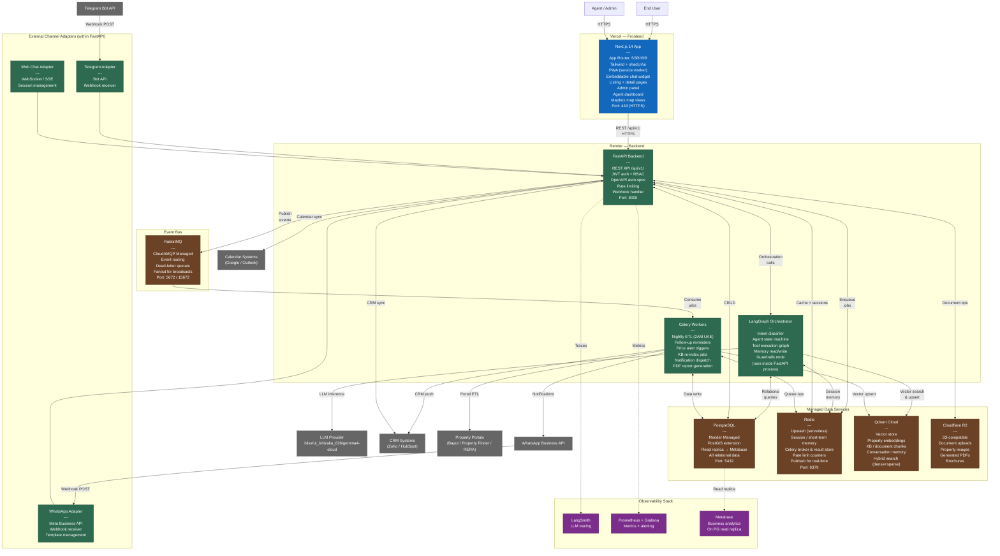

# C4 Level 2 — Container Diagram

Shows all deployable units (containers) within the platform and how they communicate.

---

## Container Diagram

---

## Container Responsibilities

| Container | Technology | Host | Primary Responsibility |
|-----------|-----------|------|----------------------|
| Next.js Web App | Next.js 14, Tailwind, shadcn/ui | Vercel | SSR frontend, chat widget, listing pages, admin/agent UI, PWA |
| FastAPI Backend | Python 3.12, FastAPI | Render (web service) | REST API, business logic, webhook handling, orchestration entry point |
| LangGraph Orchestrator | LangGraph, LangChain | In-process (FastAPI) | Agent state machine, intent routing, tool execution, guardrails |
| Celery Workers | Celery 5, Python | Render (worker service) | Async jobs: ETL, nightly sync, notifications, report generation |
| PostgreSQL | PostgreSQL 16 + PostGIS | Render Managed DB | All relational data — leads, conversations, properties, tenants, audit logs |
| Redis | Redis 7 | Upstash | Session/short-term memory, Celery broker, rate limiting, pub/sub |
| Qdrant Cloud | Qdrant | Qdrant Cloud | Vector store for property search (hybrid), RAG chunks, long-term memory |
| Cloudflare R2 | S3-compatible | Cloudflare | Document/image storage, PDF output, brochures, 7-year retention |
| RabbitMQ | RabbitMQ 3 | CloudAMQP | Event bus for async workflows — price alerts, follow-ups, broadcasts |

---

## Inter-Container Communication

| From | To | Protocol | Notes |
|------|-----|----------|-------|
| Next.js | FastAPI | HTTPS REST | All API calls, auth via JWT |
| WhatsApp API | FastAPI | HTTPS Webhook | Signed with HMAC-SHA256 |
| Telegram API | FastAPI | HTTPS Webhook | Bot token verified |
| FastAPI | LangGraph | In-process call | Single process, no network hop |
| FastAPI | PostgreSQL | TCP (psycopg3) | Connection pool via SQLAlchemy |
| FastAPI | Redis | TCP (redis-py) | Sessions, cache, Celery enqueue |
| FastAPI | Qdrant | HTTPS gRPC | Vector ops via qdrant-client |
| FastAPI | RabbitMQ | AMQP | Event publishing |
| RabbitMQ | Celery | AMQP | Job consumption |
| Celery | PostgreSQL | TCP | Job result persistence |
| LangGraph | LLM Provider | HTTPS | LLM inference, streamed responses |
