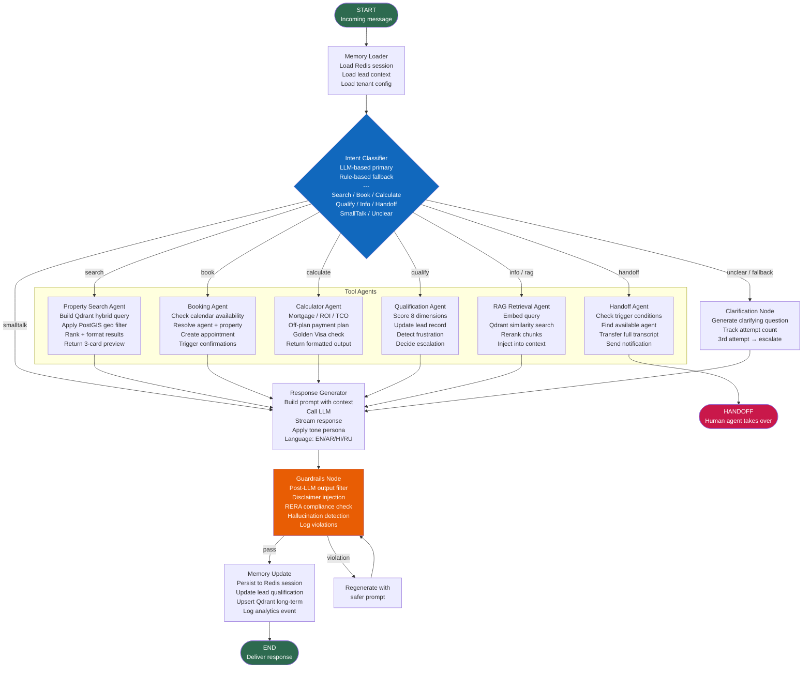
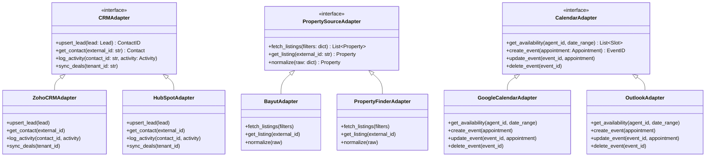

# C4 Level 3 — Component Diagram

Shows internal components within the FastAPI backend and LangGraph orchestrator.

---

## FastAPI Backend Components

```mermaid
graph TB
    subgraph "FastAPI Backend — /api/v1/"

        subgraph "API Gateway Layer"
            RL[Rate Limiter\nSliding window\nper tenant/IP]
            Auth[JWT Auth Middleware\nRS256 tokens\nRBAC enforcement]
            WH[Webhook Handler\nHMAC-SHA256 verification\nWhatsApp + Telegram]
        end

        subgraph "Routers"
            ConvRouter[Conversations Router\nPOST /conversations\nGET /conversations/:id\nWS /chat/stream]
            LeadRouter[Leads Router\nCRUD /leads\nGET /leads/:id/score\nPOST /leads/:id/handoff]
            PropRouter[Properties Router\nGET /properties/search\nGET /properties/:id\nPOST /properties/import]
            ApptRouter[Appointments Router\nPOST /appointments\nGET /appointments\nPATCH /appointments/:id]
            AdminRouter[Admin Router\nTenant config\nUser management\nGuardrail rules\nAnalytics]
            WebhookRouter[Webhook Router\nPOST /webhooks/whatsapp\nPOST /webhooks/telegram\nPOST /webhooks/crm]
        end

        subgraph "Service Layer"
            ConvService[Conversation Service\nSession lifecycle\nMessage persistence\nSentiment tracking]
            LeadService[Lead Qualification Service\n8-dimension scorecard\nConfigurable per tenant\n3-strike + frustration detection]
            PropService[Property Search Service\nPostGIS geo queries\nHybrid Qdrant search\nDubai area taxonomy\nFreehold/off-plan filters]
            BookService[Booking Service\nCustom calendar engine\nSlot availability\nConflict detection\nGoogle Cal + Outlook sync]
            CRMService[CRM Adapter Service\nZoho adapter\nHubSpot adapter\nNormalized lead schema\nBidirectional sync]
            NotifService[Notification Service\nTemplate registry\nChannel routing\nDelivery tracking\nPer-user channel pref]
            DocService[Document Service\nR2 upload/download\nWeasyPrint PDF gen\nDocuSign integration\nRAG indexing trigger]
            CalcService[Calculator Service\nMortgage (UAE rules engine)\nROI estimator\nTCO calculator\nOff-plan payment simulator\nGolden Visa eligibility]
            ETLService[ETL / Ingestion Service\nCSV importer\nCRM sync adapter\nBayut / PF adapters\nRERA adapter\nEmbedding pipeline]
            GuardrailService[Guardrail Service\nPost-LLM output filter\nDisclaimer injection\nRERA compliance statement\nConfigurable boundary rules\nFull audit logging]
            AnalyticsService[Analytics Service\nFunnel event tracking\nUTM attribution\nConversation analytics\nDaily digest trigger\nWeekly PDF report]
            I18nService[i18n / Translation Service\nLLM auto-translate\nHuman review queue\nTranslation memory\nRTL support flag]
        end

        subgraph "Data Access Layer"
            PropRepo[Property Repository\nPostgreSQL + PostGIS\nQdrant vector ops]
            LeadRepo[Lead Repository\nPostgreSQL CRUD\nQualification state]
            ConvRepo[Conversation Repository\nMessage store\nRedis session cache]
            UserRepo[User / Tenant Repository\nRBAC roles\nTenant config]
            AuditRepo[Audit Log Repository\nImmutable append-only\nAll user actions]
        end
    end

    RL --> Auth --> ConvRouter & LeadRouter & PropRouter & ApptRouter & AdminRouter
    WH --> WebhookRouter

    ConvRouter --> ConvService
    LeadRouter --> LeadService
    PropRouter --> PropService
    ApptRouter --> BookService
    AdminRouter --> LeadService & PropService & AnalyticsService & GuardrailService
    WebhookRouter --> ConvService

    ConvService --> GuardrailService
    LeadService --> CRMService & NotifService
    PropService --> PropRepo
    BookService --> CRMService & NotifService
    DocService --> ETLService

    ConvService --> ConvRepo
    LeadService --> LeadRepo
    PropService --> PropRepo
    BookService --> LeadRepo
    AnalyticsService --> AuditRepo
    GuardrailService --> AuditRepo
```

---

## LangGraph Orchestrator — Agent Graph



---

## Frontend Component Breakdown

```mermaid
graph TB
    subgraph "Next.js 14 App Router"

        subgraph "Public Routes — app/(public)/"
            HomePage[Home Page\n/\nHero + search bar]
            SearchPage[Search Page\n/search\nFilter panel + Mapbox + results]
            ListingPage[Listing Detail\n/properties/[slug]\nISR 1hr revalidation\nOpen Graph + SEO]
            CommunityPage[Community Guides\n/communities/[slug]\nLive data + RAG content]
            BlogPage[Blog & Reports\n/blog /reports\nTiptap CMS content]
            CalculatorsPage[Calculators\n/calculators\nMortgage, ROI, TCO, Golden Visa]
        end

        subgraph "Chat Widget — app/widget/"
            ChatWidget[Embeddable Chat Widget\n<script> embed\niFrame isolation\nWebSocket / SSE\nRTL Arabic support\nLanguage switcher]
            ChatMessages[Message Thread\nStreaming responses\nProperty cards\nAppointment picker\nDocument upload]
            ChatInput[Chat Input\nText + file upload\nQuick reply buttons\nVoice (future)]
        end

        subgraph "Admin Panel — app/admin/"
            TenantConfig[Tenant Configuration\nAI persona (Layla)\nGuardrail rules\nLanguage settings\nChannel config]
            PropertyMgmt[Property Management\nCSV import UI\nListing editor\nMedia upload]
            ContentCMS[Content CMS\nTiptap editor\nTranslation review queue\nMarket reports]
            AnalyticsDash[Analytics Dashboard\nFunnel metrics\nAgent performance\nAI quality scores\nMetabase embed]
        end

        subgraph "Agent Dashboard — app/dashboard/"
            LeadQueue[Lead Queue\nQualified leads\nHandoff notifications\nAssignment management]
            ConvViewer[Conversation Viewer\nFull transcript\nAI summary\nLead profile\nCRM quick-update]
            AgentCalendar[Agent Calendar\nAppointment view\nGoogle Cal sync status]
            Notifications[Notification Center\nInbound handoffs\nPrice alerts\nSystem events]
        end

        subgraph "Shared Components"
            PropertyCard[Property Card\nImage, price, beds, area\nGolden Visa badge\nOff-plan badge\nSave + share]
            MapView[Mapbox Map\nProperty pins\nDubai community polygons\nCluster on zoom-out]
            RTLProvider[RTL Provider\nArabic layout switching\ndirection: rtl CSS]
            AuthGuard[Auth Guard\nJWT cookie\nRole-based route guard]
        end
    end
```

---

## Adapter Pattern — External Integrations

All external systems are accessed through normalized adapter interfaces, making them swappable.


