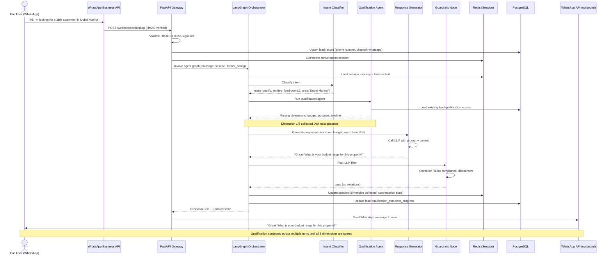
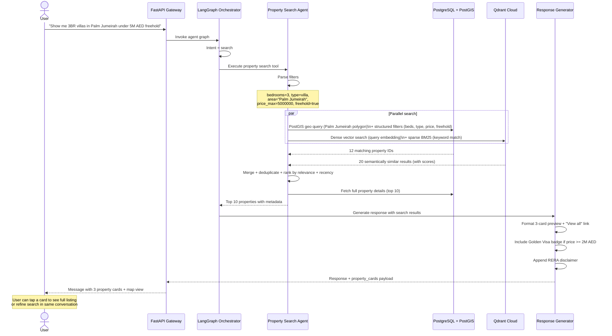
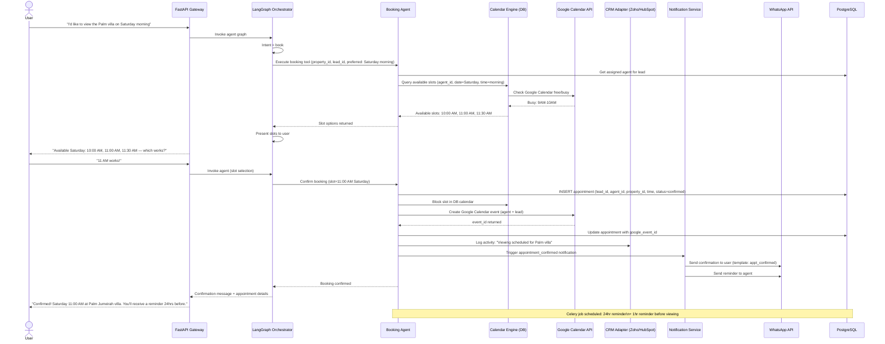
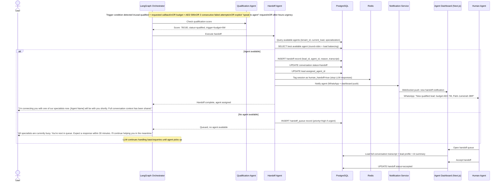
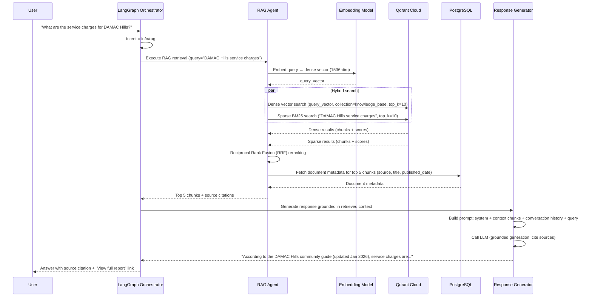
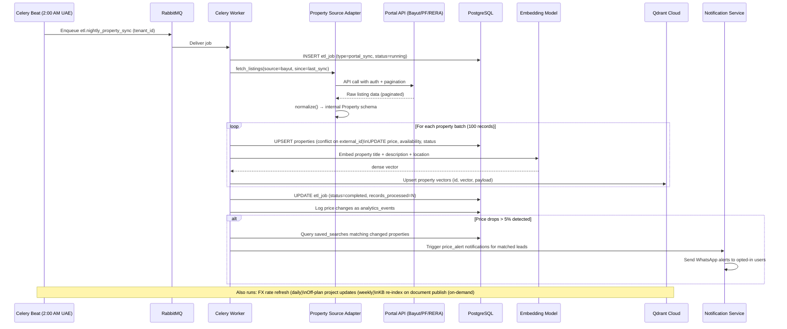

# Sequence Diagrams — Key Flows

Covers the six primary workflows in the platform.

---

## 1. New Lead — WhatsApp Message to Qualification

---

## 2. Property Search Flow

---

## 3. Appointment Booking Flow

---

## 4. Human Handoff Flow

---

## 5. RAG Document Retrieval Flow

---

## 6. Nightly ETL Pipeline

