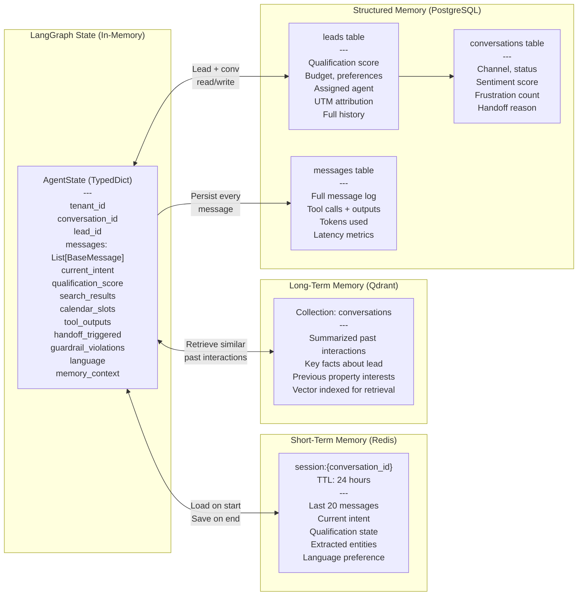

# Data Flow Diagram

Shows how data moves through the platform across ingestion, processing, and delivery paths.

---

## Primary Data Flows

```mermaid
flowchart TB
    subgraph "Data Sources"
        CSV[CSV / Manual Upload]
        ZohoSrc[Zoho CRM]
        HubSpotSrc[HubSpot CRM]
        BayutSrc[Bayut API]
        PFSrc[Property Finder API]
        RERASrc[RERA Data]
        EmaarSrc[Emaar Broker API]
        DamacSrc[Damac Broker API]
        DocUpload[User Document Upload]
        CMSContent[CMS Content\nBlogs, Guides, Reports]
    end

    subgraph "Ingestion Layer — Celery Workers"
        CSVParser[CSV Parser\n+ Validator]
        CRMSync[CRM Sync Adapter\nBidirectional]
        PortalETL[Portal ETL Adapter\nNightly 2AM UAE]
        BrokerETL[Broker API Adapter\nWeekly]
        DocIngest[Document Ingestion\nWeasyPrint → PDF]
        ContentIngest[Content Ingest\n+ Auto-translate]
    end

    subgraph "Transformation Layer"
        Normalizer[Property Normalizer\nInternal schema]
        Embedder[Embedding Pipeline\ntext-embedding model\nBatch: 100/call]
        Translator[LLM Auto-Translator\nAR / HI / RU]
        Chunker[Text Chunker\n512 token chunks\n128 token overlap]
    end

    subgraph "Storage Layer"
        PG[(PostgreSQL + PostGIS\nProperties, Leads, Conversations\nAppointments, Tenants, Audit)]
        Qdrant[(Qdrant Cloud\nCollection: properties\nCollection: knowledge_base\nCollection: conversations)]
        R2[(Cloudflare R2\nRaw docs, PDFs, Images)]
        RedisStore[(Redis\nSessions, Cache, Queues)]
    end

    subgraph "Runtime Data Flow — Conversation"
        UserMsg[Incoming Message\nWeb/WhatsApp/Telegram]
        SessionLoad[Load Session\nRedis + PG context]
        AgentGraph[LangGraph\nAgent Execution]
        LLMCall[LLM Inference\ngemma4-cloud]
        ToolExec[Tool Execution\nSearch / Book / Calc / RAG]
        ResponseOut[Response\n+ Guardrails applied]
        SessionSave[Save Session\nRedis + PG update]
    end

    subgraph "Event Flow — Async"
        RMQBus[RabbitMQ Event Bus]
        PriceAlert[Price Alert Job]
        FollowUp[Follow-up Reminder]
        NotifDispatch[Notification Dispatch\nWhatsApp / Email / SMS]
        ReportGen[Weekly Report\nPDF Generation]
    end

    subgraph "Analytics Flow"
        AnalyticsEvents[analytics_events table]
        ConvAnalytics[conversation_analytics\naggregated daily]
        MetabaseDB[(PG Read Replica)]
        MetabaseDash[Metabase Dashboards]
        DigestEmail[Daily Digest Email\nSendGrid]
    end

    %% Ingestion flows
    CSV --> CSVParser
    ZohoSrc & HubSpotSrc --> CRMSync
    BayutSrc & PFSrc & RERASrc --> PortalETL
    EmaarSrc & DamacSrc --> BrokerETL
    DocUpload --> DocIngest
    CMSContent --> ContentIngest

    %% Transformation
    CSVParser & PortalETL & BrokerETL --> Normalizer
    Normalizer --> PG
    Normalizer --> Embedder
    ContentIngest --> Chunker & Translator
    DocIngest --> Chunker & R2
    Translator --> PG
    Chunker --> Embedder
    Embedder --> Qdrant
    CRMSync --> PG

    %% Runtime conversation flow
    UserMsg --> SessionLoad
    SessionLoad --> RedisStore & PG
    SessionLoad --> AgentGraph
    AgentGraph --> LLMCall
    AgentGraph --> ToolExec
    ToolExec --> PG & Qdrant
    LLMCall --> ResponseOut
    ToolExec --> ResponseOut
    ResponseOut --> SessionSave
    SessionSave --> RedisStore & PG

    %% Event flows
    PG --> RMQBus
    RMQBus --> PriceAlert & FollowUp & ReportGen
    PriceAlert & FollowUp --> NotifDispatch
    NotifDispatch -->|"WhatsApp"| ZohoSrc
    NotifDispatch -->|"Email"| HubSpotSrc

    %% Analytics
    SessionSave --> AnalyticsEvents
    AnalyticsEvents --> ConvAnalytics
    PG --> MetabaseDB
    MetabaseDB --> MetabaseDash
    ConvAnalytics --> DigestEmail
```

---

## Memory Architecture — Conversation Context

---

## ETL Data Freshness Schedule

| Data Type | Trigger | Frequency | Method |
|-----------|---------|-----------|--------|
| Property availability | Listing change event | Event-driven (real-time) | Webhook → immediate DB update |
| Property pricing | Nightly batch | Daily 2:00 AM UAE | Celery beat + portal API |
| Off-plan projects | Weekly batch | Sunday 3:00 AM UAE | Celery beat + broker API |
| Mortgage base rates | Weekly batch | Monday 8:00 AM UAE | Celery beat + bank API (v1.1) |
| FX rates | Daily | 7:00 AM UAE | Celery beat + FX API |
| KB / brochures re-index | On publish | On-demand | FastAPI webhook → Celery job |
| CRM contact sync | Bidirectional | Every 30 min + event | Celery periodic + CRM webhook |
| RERA transaction data | Weekly | Saturday 2:00 AM UAE | Celery beat + RERA API |

---

## Data Retention & Compliance

| Data Category | Retention | Storage | Notes |
|---------------|-----------|---------|-------|
| Conversation messages | 3 years | PostgreSQL | Full audit trail, RERA compliance |
| Documents (uploaded) | 7 years | Cloudflare R2 | UAE regulatory requirement |
| Lead profiles | Indefinite (while active) | PostgreSQL | Tenant-controlled deletion |
| Audit logs | 5 years | PostgreSQL (append-only) | Immutable, all user actions |
| LLM call logs | 90 days | PostgreSQL + LangSmith | Model quality monitoring |
| Session data | 24 hours | Redis (TTL) | Auto-expired |
| Analytics events | 2 years | PostgreSQL | Funnel analysis |
| PDF reports generated | 1 year | Cloudflare R2 | Auto-purge via lifecycle rule |
