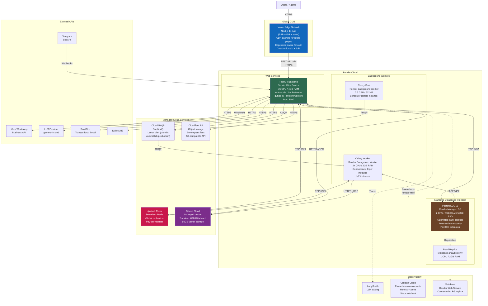
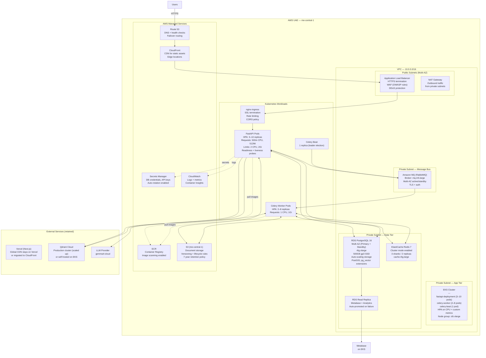
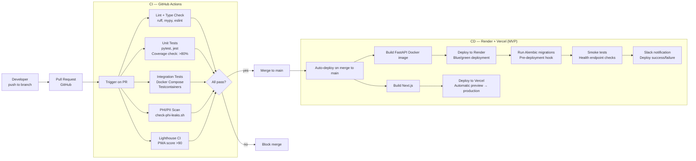

# Deployment Architecture

Two deployment topologies: MVP (Render + Vercel) for launch, Production (AWS UAE) at scale.

---

## MVP Deployment — Render + Vercel

Target: Launch (Phases 1–4). Supports 500 concurrent conversations.

---

## Production Deployment — AWS UAE (me-central-1)

Target: Post-migration (500+ concurrent, Phase 5+). Kubernetes-based.

---

## CI/CD Pipeline

---

## Environment Configuration

| Variable Group | MVP (Render) | Production (AWS) | Notes |
|----------------|-------------|-----------------|-------|
| Database | `DATABASE_URL` Render managed | `DATABASE_URL` RDS via Secrets Manager | Same env var name — no code change |
| Redis | `REDIS_URL` Upstash | `REDIS_URL` ElastiCache | Same |
| Object Storage | `R2_*` Cloudflare R2 | `S3_*` or `R2_*` | Adapter config switch |
| Message Bus | `RABBITMQ_URL` CloudAMQP | `RABBITMQ_URL` Amazon MQ | Same |
| LLM | `LLM_MODEL_ID` | `LLM_MODEL_ID` | Swappable via single env var |
| Qdrant | `QDRANT_URL` + `QDRANT_API_KEY` | Same (scaled cluster) | Same |
| WhatsApp | `WHATSAPP_*` | `WHATSAPP_*` | Same |

All secrets managed via Render Environment Groups (MVP) → AWS Secrets Manager (production).
