# Database Schema — PostgreSQL

All tables include `tenant_id` for multi-tenancy. All queries are scoped by `tenant_id`.
PostGIS extension required for geospatial queries on `locations` and `properties`.

---

## Entity Relationship Diagram

```mermaid
erDiagram
    tenants {
        uuid id PK
        string name
        string slug
        string plan
        jsonb settings
        boolean is_active
        timestamp created_at
    }

    users {
        uuid id PK
        uuid tenant_id FK
        string email
        string full_name
        string hashed_password
        enum role "superadmin,tenant_admin,agent,readonly"
        enum language "en,ar,hi,ru"
        boolean is_active
        timestamp last_login_at
        timestamp created_at
    }

    leads {
        uuid id PK
        uuid tenant_id FK
        uuid conversation_id FK
        uuid assigned_agent_id FK
        string full_name
        string phone
        string email
        enum nationality
        enum language "en,ar,hi,ru"
        int qualification_score
        enum qualification_status "unqualified,in_progress,qualified,handoff"
        decimal budget_min_aed
        decimal budget_max_aed
        jsonb preferred_locations
        enum property_type "apartment,villa,townhouse,penthouse,studio"
        enum purpose "buy,rent,invest"
        boolean pre_approved
        int timeline_months
        enum contact_preference "whatsapp,call,email"
        string crm_contact_id
        enum source_channel "web,whatsapp,telegram"
        string utm_source
        string utm_medium
        string utm_campaign
        string referral_code
        timestamp created_at
        timestamp updated_at
    }

    conversations {
        uuid id PK
        uuid tenant_id FK
        uuid lead_id FK
        enum channel "web,whatsapp,telegram"
        string external_thread_id
        enum status "active,resolved,handoff,abandoned"
        enum language "en,ar,hi,ru"
        float sentiment_score
        int frustration_count
        string handoff_reason
        uuid handoff_agent_id FK
        timestamp handoff_at
        timestamp resolved_at
        timestamp created_at
        timestamp updated_at
    }

    messages {
        uuid id PK
        uuid conversation_id FK
        uuid tenant_id FK
        enum role "user,assistant,system,tool"
        text content
        string tool_name
        jsonb tool_input
        jsonb tool_output
        int tokens_used
        int latency_ms
        boolean guardrail_triggered
        string guardrail_reason
        timestamp created_at
    }

    properties {
        uuid id PK
        uuid tenant_id FK
        uuid location_id FK
        string external_id
        enum source "csv,zoho,hubspot,bayut,property_finder,rera,emaar,damac"
        string title
        string title_ar
        text description
        text description_ar
        enum property_type "apartment,villa,townhouse,penthouse,studio,office,warehouse"
        enum status "available,sold,rented,reserved,off_plan"
        enum purpose "buy,rent,both"
        decimal price_aed
        int bedrooms
        int bathrooms
        decimal area_sqft
        string address
        decimal latitude
        decimal longitude
        geometry geom
        boolean is_off_plan
        boolean is_freehold
        boolean is_golden_visa_eligible
        string developer
        date completion_date
        jsonb payment_plan
        string virtual_tour_url
        jsonb images
        string floor_plan_url
        string brochure_r2_key
        string rera_number
        decimal roi_estimated
        string embedding_id
        timestamp last_synced_at
        timestamp created_at
        timestamp updated_at
    }

    locations {
        uuid id PK
        uuid tenant_id FK
        uuid parent_id FK
        enum level "community,sub_community,building"
        string name
        string name_ar
        string slug
        geometry polygon
        timestamp created_at
    }

    appointments {
        uuid id PK
        uuid tenant_id FK
        uuid lead_id FK
        uuid property_id FK
        uuid agent_id FK
        string title
        enum type "viewing,call,virtual_tour,meeting"
        enum status "pending,confirmed,cancelled,completed,no_show"
        timestamp start_time
        timestamp end_time
        string location
        text notes
        string google_event_id
        string outlook_event_id
        timestamp reminder_24h_sent_at
        timestamp reminder_1h_sent_at
        timestamp created_at
        timestamp updated_at
    }

    documents {
        uuid id PK
        uuid tenant_id FK
        uuid lead_id FK
        uuid conversation_id FK
        enum type "passport,proof_of_funds,noc,soa,brochure,report,contract,other"
        string filename
        string r2_key
        string r2_url
        int size_bytes
        string mime_type
        boolean is_rag_indexed
        string qdrant_point_id
        timestamp expires_at
        timestamp created_at
    }

    off_plan_projects {
        uuid id PK
        uuid tenant_id FK
        uuid location_id FK
        string developer
        string project_name
        string project_name_ar
        enum status "upcoming,launched,under_construction,handed_over"
        int total_units
        int available_units
        decimal price_from_aed
        date completion_date
        jsonb payment_plan
        string matterport_url
        timestamp launch_event_date
        boolean eoi_open
        string broker_api_id
        enum broker_source "emaar,damac,csv"
        timestamp created_at
        timestamp updated_at
    }

    eoi_submissions {
        uuid id PK
        uuid tenant_id FK
        uuid project_id FK
        uuid lead_id FK
        text expression_of_interest
        jsonb unit_preferences
        enum status "submitted,under_review,approved,rejected"
        timestamp submitted_at
        timestamp updated_at
    }

    notifications {
        uuid id PK
        uuid tenant_id FK
        uuid lead_id FK
        uuid template_id FK
        string type
        enum channel "whatsapp,email,sms,telegram"
        enum status "pending,sent,delivered,read,failed"
        jsonb payload
        string external_message_id
        timestamp sent_at
        timestamp delivered_at
        timestamp read_at
        timestamp created_at
    }

    notification_templates {
        uuid id PK
        uuid tenant_id FK
        string name
        enum channel "whatsapp,email,sms,telegram"
        enum language "en,ar,hi,ru"
        text content
        string whatsapp_template_id
        enum status "pending_approval,approved,rejected"
        timestamp created_at
        timestamp updated_at
    }

    etl_jobs {
        uuid id PK
        uuid tenant_id FK
        enum job_type "csv_import,crm_sync,bayut_sync,pf_sync,rera_sync,broker_sync,kb_reindex,fx_rates"
        enum status "queued,running,completed,failed,partial"
        string source
        int records_processed
        int records_failed
        text error_message
        jsonb metadata
        timestamp started_at
        timestamp completed_at
        timestamp created_at
    }

    analytics_events {
        uuid id PK
        uuid tenant_id FK
        uuid conversation_id FK
        uuid lead_id FK
        string event_type
        jsonb properties
        enum channel "web,whatsapp,telegram"
        timestamp created_at
    }

    saved_searches {
        uuid id PK
        uuid tenant_id FK
        uuid lead_id FK
        string name
        jsonb filters
        boolean alert_enabled
        timestamp last_alert_at
        timestamp created_at
    }

    fx_rates {
        uuid id PK
        string base_currency
        string target_currency
        decimal rate
        date rate_date
        timestamp created_at
    }

    guardrail_rules {
        uuid id PK
        uuid tenant_id FK
        string rule_name
        enum rule_type "blocked_topic,required_disclaimer,competitor_mention,price_guarantee"
        text rule_pattern
        text disclaimer_text
        boolean is_active
        timestamp created_at
        timestamp updated_at
    }

    audit_logs {
        uuid id PK
        uuid tenant_id FK
        uuid user_id FK
        string action
        string resource_type
        uuid resource_id
        jsonb before_state
        jsonb after_state
        string ip_address
        string user_agent
        timestamp created_at
    }

    %% Relationships
    tenants ||--o{ users : "has"
    tenants ||--o{ leads : "owns"
    tenants ||--o{ properties : "owns"
    tenants ||--o{ conversations : "owns"
    leads ||--o{ conversations : "has"
    conversations ||--o{ messages : "contains"
    leads ||--o{ appointments : "has"
    properties ||--o{ appointments : "for"
    users ||--o{ appointments : "agent"
    locations ||--o{ properties : "location"
    locations ||--o{ locations : "parent"
    leads ||--o{ documents : "owns"
    tenants ||--o{ off_plan_projects : "owns"
    off_plan_projects ||--o{ eoi_submissions : "receives"
    leads ||--o{ eoi_submissions : "submits"
    tenants ||--o{ notification_templates : "has"
    notification_templates ||--o{ notifications : "uses"
    tenants ||--o{ guardrail_rules : "configures"
    tenants ||--o{ audit_logs : "generates"
```



---

## Key Indexes

```sql
-- Multi-tenancy (on every table)
CREATE INDEX idx_leads_tenant ON leads(tenant_id);
CREATE INDEX idx_conversations_tenant ON conversations(tenant_id);
CREATE INDEX idx_properties_tenant ON properties(tenant_id);

-- Lead lookup
CREATE INDEX idx_leads_phone ON leads(phone);
CREATE INDEX idx_leads_qualification ON leads(tenant_id, qualification_status);
CREATE INDEX idx_leads_channel ON leads(tenant_id, source_channel);

-- Conversation performance
CREATE INDEX idx_conversations_lead ON conversations(lead_id);
CREATE INDEX idx_messages_conversation ON messages(conversation_id, created_at DESC);

-- Property search
CREATE INDEX idx_properties_status ON properties(tenant_id, status, purpose);
CREATE INDEX idx_properties_price ON properties(tenant_id, price_aed);
CREATE INDEX idx_properties_type ON properties(tenant_id, property_type, bedrooms);
CREATE INDEX idx_properties_geom ON properties USING GIST(geom);  -- PostGIS spatial
CREATE INDEX idx_properties_freehold ON properties(tenant_id, is_freehold) WHERE is_freehold = true;
CREATE INDEX idx_properties_offplan ON properties(tenant_id, is_off_plan) WHERE is_off_plan = true;

-- Analytics
CREATE INDEX idx_analytics_events_tenant_time ON analytics_events(tenant_id, created_at DESC);
CREATE INDEX idx_analytics_events_type ON analytics_events(tenant_id, event_type, created_at DESC);

-- Appointments
CREATE INDEX idx_appointments_agent_time ON appointments(agent_id, start_time);
CREATE INDEX idx_appointments_lead ON appointments(lead_id, status);

-- Audit
CREATE INDEX idx_audit_logs_tenant_time ON audit_logs(tenant_id, created_at DESC);
```

---

## Notable Design Decisions

| Decision | Implementation |
|----------|---------------|
| Multi-tenancy | Row-level: `tenant_id` on every table. RLS policies enforced at DB level (optional) |
| Soft deletes | Not used — hard delete with audit log entry. Keeps queries simple |
| Geospatial | PostGIS `geometry` columns on `properties` and `locations` for polygon containment queries |
| JSONB fields | Used for `settings`, `filters`, `payment_plan`, `images` — flexible without schema changes |
| Temporal data | All tables have `created_at`; mutable tables also have `updated_at` with trigger |
| CRM IDs | `crm_contact_id` stored on lead — nullable, set on first sync |
| Vector link | `embedding_id` / `qdrant_point_id` links PG records to Qdrant vector store |
| Currency | All money stored in AED (`decimal(15,2)`). FX display via `fx_rates` table |
