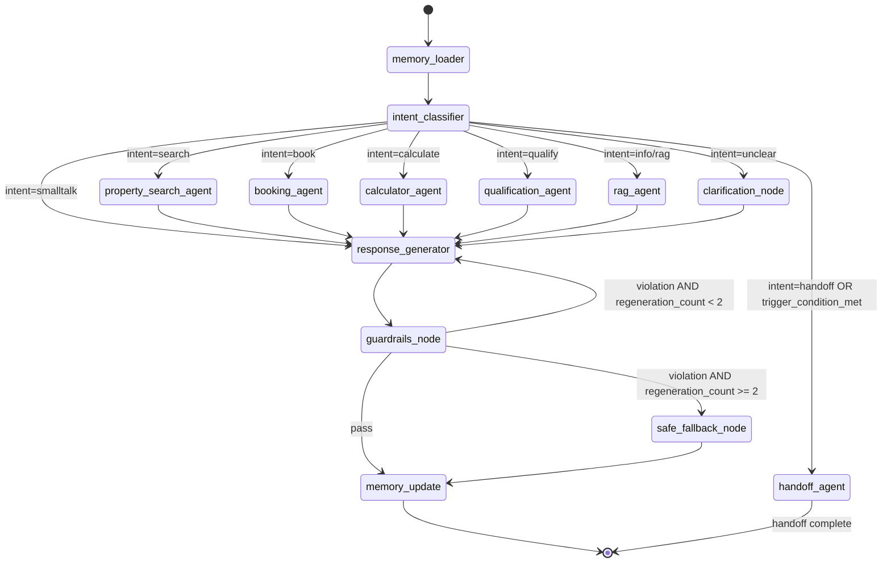

# Agent Architecture — LangGraph Orchestrator

The AI core of the platform. A stateful graph that processes every conversation turn.

---

## Agent State Schema

```python
from typing import TypedDict, List, Optional, Annotated
from langchain_core.messages import BaseMessage
from langgraph.graph.message import add_messages

class QualificationScore(TypedDict):
    budget: int           # 0–10
    property_type: int
    purpose: int
    timeline: int
    nationality: int
    pre_approval: int
    locations: int
    contact_preference: int
    total: int
    status: str           # unqualified | in_progress | qualified | handoff

class AgentState(TypedDict):
    # Identity
    tenant_id: str
    conversation_id: str
    lead_id: str
    agent_id: Optional[str]       # assigned human agent (if any)

    # Conversation
    messages: Annotated[List[BaseMessage], add_messages]
    language: str                  # en | ar | hi | ru
    channel: str                   # web | whatsapp | telegram

    # Intent
    current_intent: str            # search | book | calculate | qualify | rag | handoff | smalltalk | unclear
    intent_confidence: float
    clarification_attempts: int

    # Tool outputs
    search_results: List[dict]
    calendar_slots: List[dict]
    calculator_output: Optional[dict]
    rag_chunks: List[dict]

    # Lead context
    qualification_score: QualificationScore
    extracted_entities: dict       # budget, bedrooms, area, property_type, etc.

    # Control flow
    handoff_triggered: bool
    handoff_reason: Optional[str]
    frustration_count: int
    consecutive_failures: int

    # Guardrails
    guardrail_violations: List[str]
    regeneration_count: int

    # Memory
    session_memory: dict           # loaded from Redis
    lead_memory_context: str       # retrieved from Qdrant (long-term)

    # Tenant config
    persona_name: str              # e.g. "Layla"
    guardrail_rules: List[dict]
    tone: str                      # warm_professional | formal | casual
```

---

## Full Graph Definition



---

## Node Implementations

### `memory_loader`
```python
def memory_loader(state: AgentState) -> AgentState:
    """Load all context before agent execution."""
    # 1. Redis: load short-term session (last 20 messages, entities, qualification state)
    session = redis_client.get(f"session:{state['conversation_id']}")
    if session:
        state['session_memory'] = json.loads(session)
        state['extracted_entities'] = session.get('entities', {})
        state['qualification_score'] = session.get('qualification_score', default_score())

    # 2. Qdrant: retrieve lead long-term memory (top 3 similar past interactions)
    if state['lead_id']:
        lead_memory = qdrant_client.search(
            collection_name="conversations",
            query_vector=embed(last_user_message(state)),
            query_filter=Filter(must=[FieldCondition(key="lead_id", match=MatchValue(value=state['lead_id']))]),
            limit=3
        )
        state['lead_memory_context'] = format_memory_chunks(lead_memory)

    # 3. PostgreSQL: load lead qualification + assigned agent
    lead = db.query(Lead).filter_by(id=state['lead_id'], tenant_id=state['tenant_id']).first()
    if lead:
        state['qualification_score'] = lead.qualification_score_dict()

    # 4. Load tenant guardrail rules
    state['guardrail_rules'] = db.query(GuardrailRule).filter_by(
        tenant_id=state['tenant_id'], is_active=True
    ).all()

    return state
```

---

### `intent_classifier`
```python
def intent_classifier(state: AgentState) -> AgentState:
    """Classify intent using LLM with rule-based fallback."""
    last_message = get_last_user_message(state['messages'])

    # Rule-based fast path (no LLM call)
    if any(kw in last_message.lower() for kw in ['speak to agent', 'human', 'call me', 'agent please']):
        state['current_intent'] = 'handoff'
        state['handoff_reason'] = 'explicit_request'
        return state

    # Check auto-handoff triggers
    if should_trigger_handoff(state):
        state['current_intent'] = 'handoff'
        return state

    # LLM classification
    response = llm.invoke(INTENT_CLASSIFICATION_PROMPT.format(
        message=last_message,
        history=format_last_n_messages(state['messages'], n=5),
        entities=state['extracted_entities']
    ))

    parsed = parse_intent_response(response)
    state['current_intent'] = parsed['intent']
    state['intent_confidence'] = parsed['confidence']

    # Extract entities from classification
    state['extracted_entities'].update(parsed.get('entities', {}))

    return state

def should_trigger_handoff(state: AgentState) -> bool:
    """Check all 5 handoff trigger conditions."""
    score = state['qualification_score']
    return (
        (score['status'] == 'qualified' and score.get('contact_preference') == 'callback')
        or (state['extracted_entities'].get('budget_max_aed', 0) > 5_000_000)
        or (state['consecutive_failures'] >= 3)
        or (state['frustration_count'] >= 2 and is_after_hours())
    )
```

---

### `property_search_agent`
```python
async def property_search_agent(state: AgentState) -> AgentState:
    """Execute hybrid property search (PostGIS + Qdrant)."""
    entities = state['extracted_entities']

    # Build structured filter for PostgreSQL
    pg_filters = PropertyFilters(
        tenant_id=state['tenant_id'],
        bedrooms=entities.get('bedrooms'),
        property_type=entities.get('property_type'),
        price_max=entities.get('budget_max_aed'),
        price_min=entities.get('budget_min_aed'),
        purpose=entities.get('purpose', 'buy'),
        is_freehold=entities.get('is_freehold'),
        is_off_plan=entities.get('is_off_plan'),
        area_slug=entities.get('area'),
        status='available'
    )

    # Parallel search
    pg_task = asyncio.create_task(
        property_repo.postgis_search(pg_filters, limit=50)
    )
    qdrant_task = asyncio.create_task(
        qdrant_client.search(
            collection_name="properties",
            query_vector=await embed(build_search_query(entities)),
            query_filter=build_qdrant_filter(state['tenant_id'], pg_filters),
            limit=20,
            with_payload=True
        )
    )

    pg_results, qdrant_results = await asyncio.gather(pg_task, qdrant_task)

    # Merge with RRF ranking
    merged = reciprocal_rank_fusion(pg_results, qdrant_results, k=60)
    state['search_results'] = merged[:10]

    return state
```

---

### `qualification_agent`
```python
def qualification_agent(state: AgentState) -> AgentState:
    """Score 8 qualification dimensions and determine next question."""
    entities = state['extracted_entities']
    score = state['qualification_score']

    # Score each dimension from extracted entities
    score['budget'] = score_budget(entities.get('budget_min_aed'), entities.get('budget_max_aed'))
    score['property_type'] = 10 if entities.get('property_type') else 0
    score['purpose'] = 10 if entities.get('purpose') else 0
    score['timeline'] = score_timeline(entities.get('timeline_months'))
    score['nationality'] = 10 if entities.get('nationality') else 0
    score['pre_approval'] = 10 if entities.get('pre_approved') is not None else 0
    score['locations'] = min(10, len(entities.get('preferred_locations', [])) * 5)
    score['contact_preference'] = 10 if entities.get('contact_preference') else 0

    score['total'] = sum(v for k, v in score.items() if k not in ('total', 'status'))
    score['status'] = (
        'qualified' if score['total'] >= 70
        else 'in_progress' if score['total'] > 0
        else 'unqualified'
    )

    # Persist to DB
    lead_repo.update_qualification(state['lead_id'], score)
    state['qualification_score'] = score

    # Detect frustration
    if is_frustration_signal(get_last_user_message(state['messages'])):
        state['frustration_count'] += 1

    return state
```

---

### `guardrails_node`
```python
def guardrails_node(state: AgentState) -> AgentState:
    """Post-LLM output validation."""
    response = get_last_assistant_message(state['messages'])
    violations = []

    # 1. Check against tenant-configured rules
    for rule in state['guardrail_rules']:
        if re.search(rule['rule_pattern'], response, re.IGNORECASE):
            if rule['rule_type'] == 'blocked_topic':
                violations.append(f"blocked_topic:{rule['rule_name']}")
            elif rule['rule_type'] == 'required_disclaimer':
                response = inject_disclaimer(response, rule['disclaimer_text'])

    # 2. RERA compliance statement (first message only)
    if is_first_message(state) and RERA_STATEMENT not in response:
        response = prepend_rera_statement(response)

    # 3. Price guarantee check
    if contains_price_guarantee(response):
        violations.append('price_guarantee')
        response = replace_guarantee_with_disclaimer(response)

    # 4. Competitor mention
    if mentions_competitor(response):
        violations.append('competitor_mention')

    state['guardrail_violations'] = violations

    if violations and any(v.startswith('blocked_topic') for v in violations):
        state['regeneration_count'] += 1
        # Remove last assistant message to trigger regeneration
        state['messages'] = state['messages'][:-1]
    else:
        # Update last message with cleaned response
        update_last_assistant_message(state, response)
        # Log any soft violations to audit
        if violations:
            audit_log.write(state['conversation_id'], 'guardrail_soft_violation', violations)

    return state
```

---

## Tool Registry

All tools registered with the LangGraph orchestrator:

| Tool Name | Description | Called By |
|-----------|-------------|-----------|
| `property_search` | Hybrid vector + PostGIS search | Property Search Agent |
| `get_property_detail` | Fetch single property with all fields | Property Search Agent |
| `get_similar_properties` | Vector similarity for related listings | Response Generator |
| `check_calendar_availability` | Query agent's free slots | Booking Agent |
| `create_appointment` | Book a viewing/call | Booking Agent |
| `update_appointment` | Reschedule/cancel | Booking Agent |
| `update_lead_qualification` | Write qualification scores to DB | Qualification Agent |
| `get_lead_profile` | Load full lead context | Any agent |
| `calculate_mortgage` | UAE mortgage computation | Calculator Agent |
| `calculate_roi` | ROI + yield computation | Calculator Agent |
| `calculate_tco` | Total cost of ownership | Calculator Agent |
| `check_golden_visa` | Visa eligibility check | Calculator Agent |
| `rag_search_knowledge_base` | Semantic search over KB + docs | RAG Agent |
| `send_notification` | Dispatch WhatsApp/email/SMS | Any agent |
| `trigger_handoff` | Escalate to human agent | Handoff Agent |
| `get_off_plan_projects` | Off-plan listings + EOI | Property Search Agent |
| `submit_eoi` | Submit Expression of Interest | Booking Agent |

---

## LLM Abstraction Layer

```python
class LLMProvider:
    """Model-agnostic LLM interface. Swap model via LLM_MODEL_ID env var."""

    def __init__(self):
        self.model_id = os.getenv("LLM_MODEL_ID", "blissful_ishizaka_626/gemma4-cloud")
        self.client = self._build_client()

    def _build_client(self):
        # Supports: OpenAI-compatible, Anthropic, Google, local endpoints
        if "gemma" in self.model_id or "openrouter" in self.model_id:
            return OpenRouterClient(model=self.model_id)
        elif "claude" in self.model_id:
            return AnthropicClient(model=self.model_id)
        elif "gpt" in self.model_id:
            return OpenAIClient(model=self.model_id)
        else:
            raise ValueError(f"Unknown model: {self.model_id}")

    async def ainvoke(self, messages: List[BaseMessage], **kwargs) -> BaseMessage:
        with langsmith_trace(name="llm_call", metadata={"model": self.model_id}):
            return await self.client.ainvoke(messages, **kwargs)

    async def astream(self, messages: List[BaseMessage], **kwargs):
        async for chunk in self.client.astream(messages, **kwargs):
            yield chunk
```

---

## Persona Configuration (per Tenant)

Default persona: **Layla** — warm, professional, multilingual Dubai real estate specialist.

```json
{
  "persona_name": "Layla",
  "tone": "warm_professional",
  "languages": ["en", "ar", "hi", "ru"],
  "system_prompt_additions": [
    "You are Layla, a Dubai real estate specialist for {agency_name}.",
    "You have deep knowledge of Dubai communities, off-plan projects, and UAE regulations.",
    "Always respond in the language the user writes in.",
    "For Arabic responses, use Modern Standard Arabic with Gulf dialect warmth.",
    "Never guarantee prices or investment returns — always add appropriate disclaimers.",
    "RERA registration number: {rera_number}. Mention in first interaction."
  ],
  "max_response_length": 300,
  "include_property_cards": true,
  "proactive_qualification": true
}
```

Tenant admins can customize: persona name, tone, system prompt additions, and language set via the admin panel.
