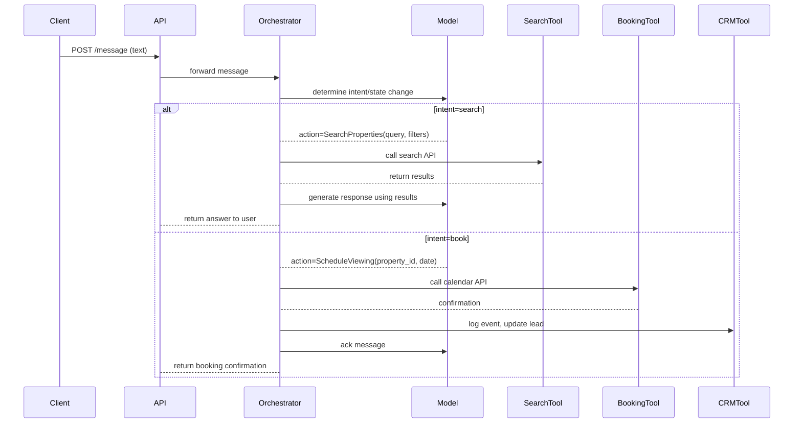
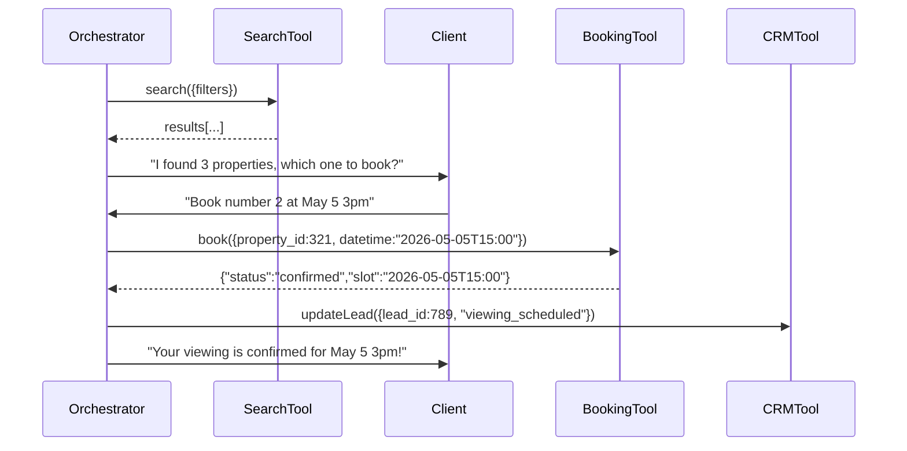
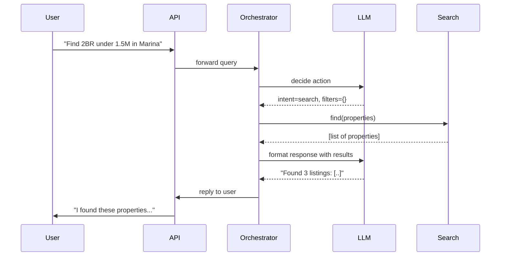
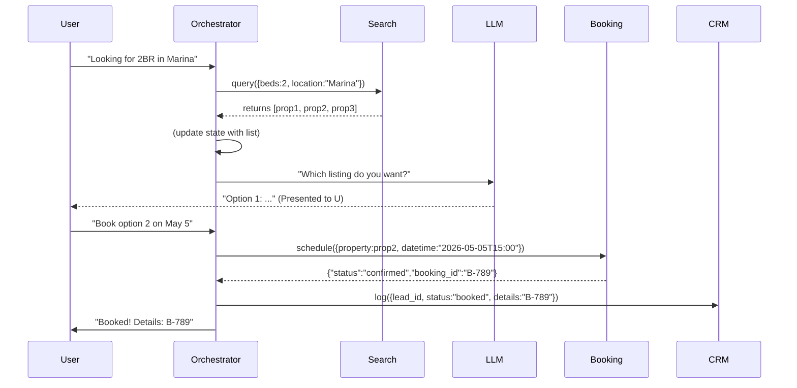

# Executive Summary  
We propose a **production-grade AI agent platform** for a real estate customer-service/sales assistant, architected for reliability, scalability, and full end-to-end workflows (lead intake → qualification → booking). The system is **multi-agent** and data-driven, not just a chat overlay. Key components include an **API gateway**, a **graph-based orchestrator** (central brain), and specialized **tool agents** (search, booking, CRM updates, mortgage calculator, notifications).  A layered **memory system** (short-term Redis + long-term vector DB + SQL) and **data layer** (PostgreSQL, S3, ETL) underpin the knowledge base.  A **retrieval (RAG) pipeline** enriches context with property data and market info, and an **event-driven bus** handles asynchronous tasks (e.g. follow-ups). We enforce **guardrails** (input/output validation, security) and full **observability** (metrics, logging, tracing). 

The architecture follows best practices from production AI systems【30†L96-L104】【30†L193-L201】. We separate concerns into layers (ingestion → retrieval → reasoning → action → logging【1†L79-L87】【30†L96-L104】). Each component is detailed below with responsibilities, APIs, data schemas, sequence flows, error/scale handling, and security. We also provide an implementation roadmap, developer tasks, test strategies, CI/CD pipeline, and code samples for critical logic (orchestrator, tools, memory, RAG, booking). Tables compare candidate technologies (LLMs, vector DBs, agent frameworks, queues) by trade-offs.

【2†embed_image】 *Figure: High-level agentic architecture (lead ingestion → orchestrator → tools → memory & data, with guardrails and CRM sync). This layered design handles lead normalization, RAG context, tool execution, and logging【1†L79-L87】【30†L96-L104】.*  

## High-Level Architecture  
Our system is organized into logical layers:  
- **API Gateway:** Entry point (authentication, rate-limiting, logging) for web/mobile/chat/voice clients. 
- **Orchestrator Layer:** A stateful agent orchestrator (graph-based), directing queries, invoking tools, tracking conversation state and long-running workflows【30†L123-L131】【4†L98-L107】.  
- **Tools Layer:** External function/call interfaces (property search, booking/calendaring, CRM integration, mortgage calculator, notifications).  
- **Memory Layer:** Two-tier memory (short-term session context in Redis; long-term semantic memory in a vector DB + key user profiles, plus structured SQL for authoritative data)【4†L150-L158】【11†L588-L597】.  
- **Data Layer:** Core databases and storage – PostgreSQL for users, properties, leads; S3/MinIO for documents/media; ETL pipelines for ingesting listings.  
- **Retrieval (RAG) Layer:** Embedding-based retrieval over knowledge (property docs, market reports, FAQ) to ground answers【1†L73-L82】【22†L966-L974】.  
- **Event Bus:** Queue system (Kafka/RabbitMQ/SQS) for asynchronous workflows (e.g. follow-up triggers, calendar tasks).  
- **Monitoring/Analytics:** Centralized logging, metrics, and trace collection for observability (Prometheus/Grafana, LangSmith/LangChain tracking)【30†L193-L201】【32†L164-L172】.  
- **Guardrails/Safety:** Input/output validation, schema checks, PII filtering, rate and cost controls to prevent misuse【30†L174-L183】【28†L780-L788】.  

Each layer is separately scalable and secure. For example, the orchestrator can run in Kubernetes (managed by Horizontal Pod Autoscaler) with an external state store (Redis/Postgres); the vector DB can be managed (Pinecone, Milvus) or self-hosted; tools are microservices with their own scaling. We assume a cloud-agnostic setup (e.g. using AWS/EKS or GCP/Azure equivalents) with managed services for RDS and object storage (S3/GCS) and secrets encryption (KMS).

## API Gateway  
**Responsibility:** Securely expose endpoints to clients (web chat, mobile apps, WhatsApp, voice, etc.) and forward them into the system. It handles **authentication/authorization** (OAuth/JWT or API keys), **rate limiting**, CORS, TLS termination, and request logging.  

- **Tech:** FastAPI/Express for business logic behind a managed API layer (e.g. Kong or AWS API Gateway).  
- **Endpoints:**  
  - `POST /api/v1/message` – Primary entry: accepts user messages/queries. Payload e.g. `{ user_id, session_id, text }`.  
  - `POST /api/v1/voice` – (if voice) receives transcribed text.  
  - `POST /api/v1/auth` – (if using login) returns JWT.  
  - `POST /api/v1/events` – webhook for external triggers (e.g. calendar events, incoming leads).  
- **Examples:**  
  ```http
  POST /api/v1/message
  Content-Type: application/json
  Authorization: Bearer <token>
  { 
    "user_id": "123", 
    "session_id": "abc", 
    "text": "I'm looking for a 3BR in Dubai under 5M", 
    "context": { ... } 
  }
  ```  
- **Responsibilities:** Validate input (schema, auth token), then enqueue or forward to Orchestrator service.  

- **Error Handling & Throttling:** 400 on invalid input, 401/403 for auth issues, 429 for rate limits. In case of gateway failure, respond with generic error. Use a circuit breaker for downstream calls (e.g. if orchestrator is down, return “service unavailable”).  

- **Scaling/Cost:** Stateless and autoscalable (e.g. behind Kubernetes Ingress or Lambda/API Gateway). Rate-limits protect against abuse (spikes from DoS). Cost is mainly in the orchestration and LLM usage, not the gateway itself.  

- **Security:** TLS, JWT verification using a secret store (Kubernetes secrets or AWS Secrets Manager). Store API keys/credentials in a secure vault.  

- **Observability:** Log request count, latency per endpoint, auth failures. Metrics via Prometheus exporter on the API container. Track user/session metrics (calls per user).  

## Agent Orchestrator (Graph-Based)  
**Responsibility:** The “brain” that manages conversation/workflow state, orchestrates specialized agents, and calls tools. It **never calls the LLM as a black box** for the whole task. Instead, it runs a controlled reasoning loop (per the **ReAct** pattern【11†L549-L558】) or a state-machine graph. The orchestrator inspects the global conversation state (our source of truth) and decides the next action: respond directly, call an external tool, retrieve info, or escalate to human【4†L98-L107】【30†L123-L131】.  

**Architecture:** We use a **graph-based agent framework** (e.g. LangGraph by LangChain【29†L146-L155】【11†L663-L672】) or Microsoft’s Semantic Kernel (both support multi-agent orchestration). These frameworks let us define **nodes** (e.g. “SearchAgent”, “BookingAgent”) and **edges** (logic flows). The orchestrator maintains a JSON state object (e.g. `State { session_id, user_id, status, intent, context:{...}, plan:[...] }`). On each user input, the orchestrator updates state and triggers the appropriate agent node (like a Directed Acyclic Graph with loops).



- **Flow Examples:**  
  - *Simple Query:* “Show 2BR in Marina.” Orchestrator calls a **PropertySearch** tool, then formats results.  
  - *Complex Workflow:* Multi-turn booking (“Book a viewing for apt #123 tomorrow at 3pm”). The orchestrator: resolves “apt #123” (from memory), checks availabilities (Booking tool), updates CRM, and then confirms to user.  

- **Pseudocode (simplified):**  
  ```python
  state = load_state(session_id) or create_new_state()
  state['context'].append(user_message)
  # LLM decides what to do next
  action = llm_decide_action(state['context'])
  if action.type == "tool":
      result = call_tool(action.name, action.args)
      state['context'].append(result)
      response = llm_generate_response(state['context'])
  else:
      response = llm_generate_response(state['context'])
  save_state(state)
  return response
  ```
  (Actual implementation uses LangGraph or SK orchestration routines for durable, restartable execution.)

- **Data Models (State):**  We define a JSON schema for the conversation state, e.g.:  
  ```json
  {
    "session_id": "abc123",
    "user_id": "u987",
    "status": "active",
    "intent": null,
    "entities": { "location": "Marina", "budget": 2_000_000 },
    "tool_results": [],
    "conversation_history": [ ... ],
    "human_approval_required": false
  }
  ```
  This state object is stored in short-term memory (Redis) and checkpointed to long-term store if needed.

- **Error Handling:** If a tool call fails (timeout, exception), orchestrator catches it, logs the error, and either retries (with backoff) or asks the user to rephrase. E.g. “Sorry, I couldn’t reach the calendar server; please try again later.” Failed states can be resumed thanks to durable state storage【29†L150-L158】.

- **Scaling:** The orchestrator is stateless aside from the state store. We can run multiple instances (pod replicas) behind a load balancer. State is externalized to Redis or a DB, enabling horizontal scaling【4†L133-L142】. For long-running flows, tasks can be queued (event triggers).

- **Observability:** Use LangSmith/LangChain’s tracing or custom logging to capture each agent step, prompt, and tool invocation. Metrics include per-intent latency, tool success/failure rates, and conversation dropouts. Trace IDs propagate through calls for distributed tracing.

## Tools Layer (Integrations)  
Each **tool** encapsulates real-world actions or data queries, exposing a clean API to the orchestrator. The agent calls tools via function calls (OpenAI function-calling or equivalent). Key tools:  

- **Property Search Tool:** Queries the property database.  
  - *API:* `POST /tools/search` with JSON filters `{ bedrooms, location, price_max, freehold, ... }`.  
  - *Response:* List of property objects `{ id, address, price, features, photos_url }`.  
  - *Example:* Searching 2BR in Marina:  
    ```json
    Request:  { "bedrooms": 2, "location": "Dubai Marina", "price_max": 1_500_000 }
    Response: [{ "id": 123, "price": 1_450_000, "address": "X Marina, Dubai", "freehold": true, "roi": "7%" }, ... ]
    ```
  - *Logic:* Translates filter inputs to SQL or Elasticsearch queries on the listings DB.  
  - *Error:* If no results, returns empty list (agent can respond “no matches found”). Timeouts or DB errors return an error code.

- **Booking Tool:** Manages viewing appointments.  
  - *API:* `POST /tools/book` with `{ property_id, user_id, datetime }`.  
  - *Operation:* Checks an internal schedule/Calendar API (e.g. Office365/Google Calendar or a calendar DB). Books slot and returns confirmation ID.  
  - *Example:*  
    ```json
    { "property_id": 123, "user_id": 987, "datetime": "2026-05-05T15:00:00Z" }
    ```
    Response: `{ "status":"confirmed", "booking_id": "bk-456", "agent": "Alice" }`.
  - *Logic:* Ensures no double-booking by atomic DB transactions or API.  
  - *Error:* If slot unavailable, returns a failure (“requested time not available; here are alternatives” with suggested times). The orchestrator may prompt user to choose a new time.

- **CRM Tool:** Logs leads and updates them.  
  - *API:* `POST /tools/crm` with `{ lead_id, status, notes, tags }`.  
  - *Operation:* Updates the internal CRM (e.g. Salesforce or custom) with activities (new message, lead qualification, booking done).  
  - *Example:* `{ "lead_id": 555, "status": "viewing_scheduled", "notes": "Booking #bk-456" }`.  
  - *Logic:* Ensures idempotency (each lead update has a unique event ID).  
  - *Error:* Retry on transient failure; escalate if repeated failures.

- **Mortgage/ROI Calculator:**  
  - *API:* `POST /tools/calc` with property price and terms.  
  - *Response:* `{ "monthly_payment": ..., "roi_percent": ... }`.  
  - *Use case:* User asks financing questions or ROI. Orchestrator calls this after retrieving price.  

- **Notification Tool:** Sends emails/SMS/WhatsApp.  
  - *API:* `POST /tools/notify` with `{ user_id, channel, message }`.  
  - *Logic:* Uses a third-party service (SendGrid, Twilio, WhatsApp Business API) to ping the user. Useful for reminders/follow-ups triggered by events.

- **Map/Geo Tool:** (Optional) If “near metro”, calls a map API to find areas.  
- **Intent/Translation Tool:** (Optional) Detects language or sentiment, but these can also be internal LLM steps.

**Tool Sequence Diagram (Search + Booking):**  


- **Error Handling:** Each tool call includes validation. For example, before booking, the orchestrator verifies date format and user privileges. Failed tool calls trigger retries (exponential backoff) or fallback logic (e.g. “Try a different agent” or human handoff). Idempotency keys prevent duplicate bookings on retries.

- **Scaling & Cost:** Tools are regular services behind load balancers (e.g. FastAPI + Redis or DB). Auto-scale on usage. The cost drivers: DB/query complexity (use proper indexes), external API fees (e.g. SMS costs). Cache frequent searches if needed. Use cloud auto-scaling (K8s HorizontalPodAutoscaler). For cost savings, critical but cheap calls (e.g. mortgage calc) can run on the orchestrator without external requests.

- **Security:** Tools have their own authentication (e.g. ORM with DB credentials in env vars, Calendar API with OAuth tokens). API Gateway should restrict internal endpoints so only the orchestrator can call them (mutual TLS or network ACLs). Sensitive data (user contacts, CRM keys) encrypted at rest and in transit.

- **Observability:** Each tool logs invocation count, error count, and latency. For example, monitor the number of searches per hour, booking success rate, CRM calls per session. Use OpenTelemetry to trace a request across orchestrator → tool calls.

## Memory Layer  
**Responsibility:** Maintain conversational context and user-specific data across sessions. We implement a **tiered memory**【4†L150-L158】【11†L588-L597】:  
1. **Short-Term Memory (Session Context):** Fast Redis store holding the current conversation’s state (slots, recent messages, pending tasks). This is the “scratchpad”【4†L150-L158】 where ephemeral variables live. E.g. `session:<session_id>` key with a JSON blob of the conversation state. This memory is reset or archived when the session ends. Redis with a sliding expiration (e.g. 30 minutes after last activity) is ideal.  
2. **Long-Term Semantic Memory:** A **vector database** (e.g. Pinecone, Weaviate, or self-hosted FAISS/Milvus) stores embedded vectors of past interactions, user preferences, and knowledge snippets (e.g. “User prefers Marina District”, “Asked about mortgages”). When the orchestrator needs past context (e.g. user says “You already told me I want Dubai Marina.”), it can query this memory. The vector DB is **namespaced** by user or tenant to ensure isolation【4†L150-L158】.  
3. **Structured System Memory:** A relational DB (PostgreSQL) is the source of truth for static records (user profiles, property list, lead history). Agents do not “hallucinate” key facts; they look up data via queries. For example, the property schema or user’s contact info is always fetched from Postgres or CRM, not just remembered by the model.

【13†embed_image】 *Figure: Memory hierarchy for agents【4†L150-L158】. “Hot” short-term memory (Redis) holds the current chat state; “warm” long-term memory (vector DB) holds embeddings and recalled facts; “cold” system-of-record (SQL) holds authoritative data.*  

- **Data Models:**  
  - *Redis:* Simple key-value with JSON. E.g. `session:abc123` → `{ user_id, last_intent, context: [chat messages], current_slots: {budget:1.2M, beds:2} }`.  
  - *Vector DB:* Documents like “User:123 said they prefer 2BR in Marina” stored as text vector, or “Car Rental query context” from training. We index by user/tenant.  
  - *PostgreSQL:* E.g. `Users(user_id, name, contact, preferences_json)`, `Leads(lead_id, user_id, status)`, `Properties(id, address, price, features_json)`, etc.  

- **APIs:**  
  - `GET /memory/session/<id>`: retrieve session state.  
  - `POST /memory/session/<id>`: update session state.  
  - Internal functions in orchestrator to write/read to Redis.  
  - `PUT /memory/user/<id>`: update long-term info (e.g. user said new preference) – usually via vector DB SDK.  
  - Vector DB integration is via SDK (Pinecone client) inside the orchestrator code, not exposed as HTTP.

- **Sequence (Memory Use):**  
  ```mermaid
  sequenceDiagram
    Client->>API: "I prefer Dubai Marina"
    API->>Orchestrator: receive message
    Orchestrator->>Redis: read session:abc123
    Orchestrator->>VectorDB: upsert(vector("User:123 prefers Marina"), user_id=123)
    Orchestrator->>Orchestrator: store slot location="Marina"
    Redis-->>Orchestrator: session state
    Orchestrator->>Client: "Got it, saving your preference!"
  ```
  On future query:  
  ```mermaid
  sequenceDiagram
    Client->>API: "Got any deals in Marina?"
    API->>Orchestrator: 
    Orchestrator->>VectorDB: query("Marina")
    VectorDB-->>Orchestrator: returns user_id=123 context, etc.
    Orchestrator->>Postgres: query Properties with location="Marina"
    Orchestrator->>Client: respond with listings
  ```

- **Error Handling:** If Redis or the vector DB is unavailable, the system continues with degraded functionality. We may skip retrieval or ignore memory if the store is down, returning best-effort answers. Failures are logged; retries are attempted for temporary errors. Because Redis is in-memory, we checkpoint critical state to a durable store (e.g. Postgres or disk) on session end for recovery【29†L150-L158】.

- **Scaling:** Redis runs as a cluster (scaled by memory). The vector DB can be managed (Pinecone, Milvus cloud) or sharded across nodes. Use namespaces or separate DB instances per region/tenant. Vector stores often have per-query cost, so cache common queries where possible.  

- **Security:** Sensitive conversation data should be encrypted at rest (Redis encryption, secrets in transit). Vector DB entries (embeddings) should scrub PII. Implement access controls so only the orchestrator service can query memory stores.

- **Observability:** Track hits/misses on memory, cache rate, vector DB query latency. Log when memory data is written (for audit). Use LangSmith or a custom memory tracer to examine what the agent recalls.  

## Data Layer  
**Responsibility:** Store authoritative data and knowledge.  
- **PostgreSQL:** Core relational data (users, agents, properties, leads, transactions). Schema examples:  
  ```sql
  CREATE TABLE Properties (
    id SERIAL PRIMARY KEY,
    address TEXT,
    location VARCHAR(100),
    price NUMERIC,
    freehold BOOLEAN,
    features JSONB,  -- e.g. {bedrooms, baths, area}
    created_at TIMESTAMP
  );
  CREATE TABLE Leads (
    id SERIAL PRIMARY KEY,
    user_id INT REFERENCES Users(id),
    source VARCHAR(50),  -- e.g. "website", "WhatsApp"
    status VARCHAR(20),
    last_contacted TIMESTAMP
  );
  CREATE TABLE Users (
    id SERIAL PRIMARY KEY,
    name TEXT, email TEXT, phone TEXT,
    preferences JSONB
  );
  ```  
- **S3/Object Storage:** Holds unstructured data: brochures, floorplan images, market reports (PDFs). These are indexed via RAG embeddings.  

- **ETL Pipelines:** Regular jobs (e.g. nightly or streaming) to ingest listings from MLS/Zillow or update prices. Tools: AWS Glue/Airflow/etc to fetch, clean, and upsert into Postgres and vector store.  

- **APIs/Data Access:**  
  - Backend services (tools, orchestrator) query Postgres via ORM (e.g. SQLAlchemy).  
  - ETL jobs have connectors (e.g. AWS DMS or custom scripts).  

- **Error Handling:** Transactions ensure DB consistency. Use read replicas for heavy load. In case of DB failover, alert ops. Stale cache can serve reads if needed.  

- **Scaling/Cost:** RDS (Postgres) with multi-AZ for HA. Use read replicas for scaling reads (e.g. search tool queries). If listing volume is huge, consider partitioning (by city) or Elasticsearch for full-text, though for structured filters Postgres is fine. S3 costs for storage; enable lifecycle policies for old assets.  

- **Security:** VPC isolated, DB credentials in vault. Data encrypted (TDE). Role-based access: only the relevant service account can write listings.  

- **Observability:** DB query latency and errors (via DB monitoring). ETL job success rates. Data freshness metrics (e.g. “last sync 2h ago”).  

## Retrieval / RAG Pipeline  
**Responsibility:** Ground AI answers in real data via retrieval. We build a **RAG pipeline** that embeds and indexes relevant knowledge (property descriptions, FAQs, market trends) for contextual queries【1†L73-L82】【22†L966-L974】.  

- **Source Data:** Property descriptions, neighborhood guides, mortgage FAQ, investment reports. These are chunked and vector-encoded.  
- **Tools:** Use an embedding model (OpenAI/Azure / HuggingFace) to index text into a vector DB. At query time, the agent uses the retrieval tool: embed the query, fetch top-k relevant chunks, and provide them to the LLM prompt to ensure factual answers.  

- **Flow:**  
  1. **Ingestion:** ETL job (or API) ingests docs into vector store with metadata (e.g. `{ doc_id, vector, source }`).  
  2. **Query-Time:** Orchestrator detects a factual question (via intent or trigger) and calls `RetrievalAgent` which does: embed user query → vector DB query → return texts.  
  3. **Generation:** LLM is then prompted with the retrieved context (plus conversation) to generate grounded answer.  

- **APIs:** Internal calls within orchestrator code. Not public endpoints. Example (pseudocode):  
  ```python
  query_vec = embed_model.encode(user_question)
  results = vector_db.query(query_vec, top_k=5, filter={"source": "property_facts"})
  context = [r.text for r in results]
  response = llm.generate(prompt=f"Answer using these facts:\n{context}\n\nQ: {user_question}")
  ```  

- **Data Models:** Stored vectors have fields:  
  ```
  { 
    embedding, 
    metadata: { "type": "listing_desc" or "market_faq", "id": 456 }, 
    content: "Full text of chunk" 
  }
  ```  

- **Error Handling:** If no relevant docs, the agent falls back to general knowledge or says “I don’t have that info.” Avoid hallucination by disallowing model to invent facts without source. If embedding service fails, skip retrieval.  

- **Scaling:** Vector DBs like Pinecone or Weaviate auto-scale with usage【22†L984-L993】. For high query loads, ensure adequate replicas. Chunk size and index parameters (IVF/HNSW) tuned for speed. Use CPU/GPU acceleration where needed. For cost: managed services charge per query; consider an on-prem cluster for very heavy loads (FAISS on GPU)【23†L149-L158】.  

- **Security:** The retrieved content is vetted (no unapproved user data). The vector DB can have ACLs, or exist within a private network.  

- **Observability:** Track retrieval query latency, top-k hit rates. Monitor ratio of answers citing retrieval vs hallucinations. Use golden benchmarks (e.g. known Q&A sets) in testing.

## Event-Driven System  
**Responsibility:** Decouple asynchronous tasks via messaging. Use a **message broker** (Kafka, RabbitMQ, or AWS SQS/SNS) to handle events like new lead arrival, follow-up reminders, escalations.  

- **Example Flows:**  
  - A lead submits a form → **LeadIngestor** publishes `Event:NewLead(user_id,lead_id)`. Downstream *LeadQualifierAgent* consumes it.  
  - After 24h inactivity: a scheduled job emits `Event:FollowUpReminder(user_id, lead_id)`, triggering notification tool.  
  - Price drop alert: `Event:PriceAlert(property_id, new_price)` triggers outreach.  

- **Data Model:** Events are simple messages (JSON) on topics/queues. E.g.:  
  ```json
  {"type":"NewLead","timestamp":"2026-05-01T12:00Z","payload":{"lead_id":789,"user_id":123}}
  ```  

- **Error Handling & Retry:** Each event consumer (worker) should use an acknowledgement system. On failure, move to a **dead-letter queue** after N retries. Ensure idempotency: e.g. include event IDs so re-processing doesn’t duplicate. For Kafka, committed offsets; for RabbitMQ/SQS, retry logic with DLX.  

- **Scaling/Cost:** Kafka is high-throughput (suitable if loads are massive)【28†L780-L788】, RabbitMQ is simpler (excellent multi-protocol support, lower latency at small scale)【28†L807-L815】. The team may choose both: Kafka for heavy event streams (analytics, inter-service events) and RabbitMQ for request/response or priority tasks【28†L842-L852】【28†L854-L862】. Managed services (AWS MSK, AWS MQ, Google Pub/Sub) reduce ops overhead.  

- **Security:** Events may carry user data; encrypt topics and use ACLs so only authorized services can publish/subscribe.  

- **Observability:** Monitor queue lengths, consumer lag (Kafka), and unprocessed messages. Use metrics to trigger alarms if backlog grows.  

## Analytics & Monitoring  
**Responsibility:** Track system health, usage metrics, and business KPIs.  

- **Monitoring:**  
  - **Infrastructure:** CPU/memory of services (Prometheus + Grafana).  
  - **Application Metrics:** Custom metrics (via OpenTelemetry or StatsD) for key events: API requests, tool calls, booking events, memory hits, LLM token usage. E.g. count of leads processed per hour, number of chats, success rate of bookings.  
  - **LLM Costs:** Tokens consumed per query, cost per invocation (track with logs).  

- **Logging/Tracing:** Centralized log aggregation (ELK or Loki) capturing request IDs. Each user session has a trace ID. Log every prompt, action, and tool response in JSON form for analysis. Use distributed tracing to follow a user request across multiple microservices (Jaeger or OpenTelemetry).  

- **Alerts:** Set thresholds (e.g. error rate > 5%, latency > x). Anomaly detection on user drop-off (sudden increase in unfinished flows).  

- **Analytics/Dashboard:**  
  - *User Metrics:* conversion funnel (chats started → qualified → booked).  
  - *Agent Metrics:* average time-to-response, percentage of queries handled fully by AI vs escalated.  
  - *Model Performance:* using logs, measure hallucination rate (maybe via a blind-review tool).  

- **Example:** We integrate LangSmith/LangChain’s tracing tools【29†L146-L155】【32†L164-L172】 to log every agent step and evaluate correctness.  

- **Performance Testing:** Simulate peak loads (e.g. 1000 concurrent chats) and monitor latency.  

## Guardrails & Safety  
**Responsibility:** Validate inputs/outputs and enforce policies. Architecturally, this is a **validation layer** before and after each LLM call【30†L174-L183】.  

- **Input Validation:** Sanitize user text (strip harmful content, escape SQL). Detect PII or sensitive requests and mask or reject. Use schema validation (e.g. expected JSON fields).  
- **Output Sanitization:** After the LLM generates text, apply filters (block profanity, enforce format). Use regex or model-based content filter for disallowed topics (e.g. illegal requests). For critical outputs (booking confirmations), verify against structured data (e.g. ensure the property ID exists)【30†L178-L187】.  
- **Confidence/Red Teaming:** If the model is uncertain (via model confidence or contradiction with facts), the orchestrator can ask clarifying questions or escalate.  
- **Cost Controls:** API gateway enforces quotas per user. The orchestrator checks length of conversation to avoid runaway cost. For example, if a single session generates >50 messages, cut off and propose human contact.  
- **Audit/Compliance:** Log all interactions in immutable storage. For real estate (often regulated), ensure sensitive info is not logged.  

- **Example (Guardrail):** If user says “What’s the ROI on property X?”, the system calculates with real data. The LLM is *not allowed* to “hallucinate” ROI. We enforce this by building the answer from actual numbers. If user asks “Does it have a pool?” but the database says no pool, the agent must answer correctly. We achieve this by only allowing the search tool’s data as truth (no guessing)【1†L79-L87】【30†L174-L183】.

## Testing Strategy  
Robust testing is mandatory. We adopt a layered testing approach【32†L164-L172】:

- **Unit Tests (8–16h):**  
  Test individual functions: parsing user input, each tool integration (use mocks for external APIs), memory read/write, database queries. Example: test `searchTool.search({"bedrooms":3})` returns correct result set given a seeded DB.  

- **Integration Tests (16–24h):**  
  Combine components: e.g. orchestrator + search tool + memory. Use a test DB and mock LLM to verify flows. For instance, simulate user messages and assert correct tool calls and state transitions.  

- **End-to-End Tests (16–24h):**  
  Simulate full user sessions (via Chat UI or API), using real LLM (maybe lower-cost model for testing) or controlled responses. Scenarios: “Lead inquiry to booking”, “Follow-up reminder triggers”, “Escalation path”. Check final outcomes (CRM updated, correct replies).  

- **AgentEvals/Offline Evaluation:** (8–16h to set up)  
  Use LangChain’s evaluation tools or custom scripts to run scripted dialogues (agent vs fixed user answers) to measure success (did it book an appointment?). Collect metrics like Answer accuracy and Task completion【32†L202-L211】.  

- **Acceptance Tests:** (8h)  
  High-level QA scenarios with domain experts: e.g.  
  - *A1:* 2BR search under budget returns correct listings (verify with manual lookup).  
  - *A2:* Booking flow actually schedules in calendar.  
  - *A3:* Memory recall (user says “I told you earlier…” and agent acknowledges context).  
  - *A4:* Hallucination check (ask known-fact question and ensure answer is correct or “I don’t know”).  

Tests are automated (pytest, Postman/Cypress for API) and run on every commit. See [32†L202-L211] for CI/CD integration of these testing layers.

## CI/CD  
**Responsibility:** Automated build, test, and deployment.  

- **Pipeline Components (GitHub Actions/Jenkins):**  
  - **Trigger:** On code push or PR. Also triggers on PromptHub or LangSmith eval alerts【32†L180-L190】.  
  - **Build:** Lint and type-check code.  
  - **Unit/Integration Tests:** Run all Python/PyTest suites.  
  - **E2E Tests:** Deploy to a staging environment (LangSmith or K8s dev cluster) and run automated user-flow tests.  
  - **Offline Eval:** Use LangChain AgentEvals to test agent quality scenarios【32†L202-L211】.  
  - **Deployment:** If tests pass, use a control-plane API (LangSmith Deployment, Kubernetes, or AWS CodeDeploy) to promote to production.  
  - **Rollback:** On failure, revert to last stable version.  

【32†L164-L172】【32†L202-L211】  
The pipeline implements best practices: code review gating, multi-layer testing, staging/prod environments, and continuous monitoring. For example, the LangChain example shows a deploy-on-merge workflow using previews and control-plane API calls【32†L219-L228】.

- **Tools:** GitHub Actions (or GitLab CI), Terraform/Helm for infra, Dockerized services. Store secrets securely. Incorporate static analysis (bandit, semgrep) for security scanning.

- **Observability:** CI metrics (build success rate, test coverage). Long-lived performance benchmarks stored for regression.

## Deployment Architecture  
**Responsibility:** Actual deployment infrastructure (cloud-agnostic).  

- **Compute:** Containerize all services (API, Orchestrator, Tools) in Docker. Deploy on Kubernetes (EKS/GKE/AKS) or AWS ECS/Fargate. K8s is preferred for flexibility: use Helm charts (one release per environment). Auto-scaling based on CPU, memory, and custom metrics (LLM usage).  
- **Databases:**  
  - **Postgres:** Use managed service (AWS RDS/Aurora or Cloud SQL) with Multi-AZ and read replicas.  
  - **Redis:** Managed (AWS ElastiCache/Redis Cluster) for high-availability.  
  - **Vector DB:** Managed Pinecone or Milvus Cloud for ease; self-host Milvus on K8s if needed.  
- **Storage:** S3 or compatible (MinIO) for unstructured data.  
- **Secrets:** K8s Secrets / Vault / AWS Secrets Manager for keys (LLM API keys, DB creds).  
- **Networking:** VPC with subnets for frontend (public) and backend (private). API gateway in public subnet, all internal traffic in private. Use Ingress with TLS (Let's Encrypt or ACM).  
- **CI/CD:** Hosted runners for builds (GitHub), deployment via kubectl or Terraform.  
- **Scaling:** Use HPA (or ECS auto-scaling). For LLM servers (if self-hosted), use cluster auto-provisioning.  
- **Cost Optimization:**  
  - Cache common responses.  
  - Use smaller LLM for simple tasks (GPT-3.5 or Claude Instant) and large LLM (GPT-4o) only for critical reasoning.  
  - Tier storage (e.g. RDS with autoscaling storage, S3 infrequent tier for old docs).  
  - Spot instances for non-critical tasks (ETL, nightly jobs).  

- **Reliability:** Run multiple replicas, health checks (readiness/liveness). Use circuit-breaker patterns on external calls. Maintain at least 2 K8s zones.  

- **Security:** All traffic encrypted in transit (TLS everywhere). Set up Web Application Firewall (WAF). Use IAM roles for service accounts. RBAC in K8s for resource limits. 

## Tech Comparison  

| Category | Option     | Pros                                        | Cons / Notes                                      |
|----------|------------|---------------------------------------------|---------------------------------------------------|
| **LLM**  | OpenAI GPT-4o (GPT-4 Omni)【24†L0-L3】 | State-of-art performance, multi-modal, fast, robust chain-of-thought. Scalable API, function-calling. | Costly ($0.06+/k token). Proprietary (limited customization). Latency ~500ms+ per call. |
|          | Anthropic Claude 3| Very large context window, strong at following instructions. Good at summarization. | API costs & quotas. Slightly slower. Less well-known community. |
|          | Google Gemini/X | Multi-modal and integration with Google Cloud. | Less open info on pricing. Possibly expensive. |
|          | LLaMA-3 (Meta)/LlamaIndex + Hercules | Open-source; can self-host (control cost, data privacy). | Requires heavy infra (GPU cluster). Generally lag behind latest closed models on tasks. |
| **Vector DB** | Pinecone【23†L149-L158】 | Fully managed SaaS, easy API, handles scale, built-in security. | Cost-per-query and storage. Proprietary. |
|          | FAISS (open-source)【23†L149-L158】 | Extremely fast (C++/GPU). Free. Fully on-prem. | No managed service (you self-host clusters). No metadata filters natively. Harder to operate at scale. |
|          | Milvus (Zilliz) | Open-source, cloud-native, strong on hybrid search (vector+keyword), used in enterprise. | Some complexity in setup. CPU/GPU support. |
|          | Weaviate      | Integrated semantic search + BM25, GraphQL API, vector + metadata filters. | Relatively young, requires resources. |
|          | Qdrant        | Easy to deploy (Go), rich filtering, good Python client. | Still maturing, fewer cloud services. |
| **Agent Frameworks** | LangChain + LangGraph【11†L663-L672】【29†L146-L155】 | Rich Python ecosystem. Graph orchestration, LangSmith tools for testing/observability. Large community/examples. | Still new patterns; graph-based approach has learning curve. |
|          | Microsoft Semantic Kernel【19†L69-L78】 | Multi-language (C#, Python), built-in orchestration patterns, official support by MS. Good for .NET shops. | Experimental; primarily .NET. Less mature UI/tools. |
|          | AutoGPT / CrewAI | Rapid prototyping, pre-built “AI team”. | Black-box behavior, less control, risk of unexpected actions. Not ideal for strict production needs. |
|          | Others (Haystack, LlamaIndex) | Good retrieval and knowledge integration, many docs/recipes. | Often limited to RAG pipelines, not full agent orchestration. |
| **Message Queue** | Apache Kafka【28†L780-L788】 | Very high throughput (hundreds of MB/s), durable log, exactly-once, replayable streams, ecosystem of connectors. | Complex to operate, JVM footprint. Learning curve. |
|          | RabbitMQ【28†L807-L815】 | Simpler to set up, supports AMQP/MQTT/STOMP, excellent routing, low latency at modest scale, built-in clustering. | Lower max throughput (~40 MB/s), memory overhead at scale. |
|          | AWS SQS/SNS  | Fully managed, pay-as-you-go, auto-scaling. | Feature-limited (FIFO ordering only with SQS). Latency ~millisecond+. |
|          | Redis Streams | Part of Redis, easy if already using Redis. Supports consumer groups. | Lacks Kafka’s durability; best for ephemeral queue. No multi-data-center. |

**References:** All above are informed by official sources and benchmarks. For example, Pinecone vs FAISS are contrasted in Milvus docs【23†L149-L158】, and Kafka vs RabbitMQ performance in an industry survey【28†L780-L788】【28†L807-L815】.  

## Folder/Repo Structure (sample)  
```text
ai-agent-real-estate/
├── api/                       # FastAPI routes & gateway logic
│   ├── main.py               # API entrypoint
│   ├── routes.py             # Endpoint handlers
│   ├── auth.py               # JWT/OAuth utils
│   └── schemas/              # Pydantic models for requests/responses
│       └── message.py        
├── orchestrator/             # Graph-based agent logic
│   ├── agent.py              # Orchestrator classes (LangGraph StateGraph)
│   ├── state_schema.json     # JSON schema for conversation state
│   └── prompt_templates/     # Reusable prompts or chains
├── tools/                    # Tool integrations
│   ├── property_search.py    # Connects to DB or search index
│   ├── booking.py            # Calendar integration code
│   ├── crm_integration.py    # CRM API client
│   ├── mortgage_calc.py      # Financial calculation utils
│   └── notify.py             # Email/SMS/WhatsApp utils
├── memory/                   # Memory layer code
│   ├── short_term.py         # Redis interface
│   ├── long_term.py          # Vector DB interface (Pinecone client wrapper)
│   └── models.py             # ORM models for SQL memory tables
├── retrieval/                # RAG pipeline
│   ├── embed.py             # Embedding functions
│   ├── index.py             # Indexing pipeline
│   ├── retrieve.py          # Query logic (vector DB querying)
│   └── utils.py
├── events/                   # Event definitions and consumers
│   ├── schemas.py           # Event message schemas
│   ├── producer.py          # Publishers to message bus
│   └── consumers/           # Handlers for different event topics
│       ├── lead_qualifier.py
│       └── follow_up.py
├── data/                     # ETL and data pipeline scripts
│   ├── etl_listings.py      # Ingest property data
│   └── sync.py              # Sync jobs (e.g. hourly price updates)
├── models/                   # Database models (SQLAlchemy)
│   ├── property.py
│   ├── user.py
│   └── lead.py
├── workflows/                # Multi-step orchestrations (if separate from core agent)
│   ├── qualify_lead.py
│   └── book_viewing.py
├── analytics/                # Monitoring and analysis (Grafana dashboards, reports)
│   ├── dashboards.yml
│   └── metrics/              
├── config/                   # Configuration files (e.g. YAML for K8s, env var templates)
│   ├── deployment.yaml
│   └── k8s/                 
├── utils/                    # Common utilities
│   ├── logging.py
│   ├── security.py
│   └── openai_client.py     # LLM call wrapper
└── tests/                    # Test suite
    ├── unit/
    ├── integration/
    └── e2e/
```
This modular layout separates concerns. Each service directory has its own code and tests. A monorepo with sub-packages or a set of micro-repos (linked by CI/CD) can both work.  

## Implementation Roadmap (Milestones)  

| Week | Milestone / Tasks                                           | Dev Effort (hrs) | Acceptance Criteria                                        |
|------|------------------------------------------------------------|-----------------|------------------------------------------------------------|
| **1**  | **Setup & Foundations:**<br>- Define requirements/claims.<br>- Set up repo, CI/CD pipeline skeleton (GitHub Actions).<br>- Deploy basic skeleton services (API Gateway stub, Orchestrator stub) on dev K8s.<br>- Implement simple health-checks, logging.  | 16 <br> (4+4+4+4)  | Repo and CI are ready. Health endpoints return OK. Team can trigger builds. |
| **2**  | **Property Search Agent:**<br>- Build `property_search` tool: schema, DB model, sample data seed.<br>- Integrate into orchestrator: user -> tool -> response.<br>- End-to-end test: query leads to correct output.<br>- Data modeling (Postgres schema for properties).  | 20 <br> (8+4+4+4) | Given known properties in DB, sample queries return expected list. Unit tests pass. |
| **3**  | **Booking & CRM Tool:**<br>- Calendar/Booking tool (stubbed or real).<br>- CRM integration (e.g. simple Postgres logging).<br>- Update orchestrator to handle “book” intents, update lead status.<br>- Sequence diagram validation: booking flow works.<br>- Multi-step conversation test: search then book.  | 24 <br> (8+8+4+4) | Booking a demo property schedules a time (we simulate calendar) and lead status updated. E2E test passes. |
| **4**  | **Memory Integration:**<br>- Implement Redis short-term store (slots, context).<br>- After conversations, ensure slots (e.g. budget, location) persist in session state.<br>- Long-term: integrate Pinecone (or FAISS) for saving & retrieving preferences. Simple example: save “prefers Marina” and test recall.<br>- Multi-turn test: agent remembers earlier slot without re-asking.  | 20 <br> (6+8+6) | User re-visits context: e.g. after giving preference, next query uses it automatically. Memory reads/writes confirmed by tests. |
| **5**  | **RAG & Knowledge Base:**<br>- Build retrieval index of sample docs (property FAQs, market data).<br>- Retrieval agent calls vector DB; verify relevant docs fetched.<br>- Extend orchestrator to include retrieved facts in answers (prompt templates).<br>- Grounded QA test: asking a factual question returns correct cited answer.  | 20 <br> (8+6+6) | When asked a known-fact (e.g. “What’s ROI?” given data), agent cites exact retrieved data. Hallucination test: unknown Q returns “don’t know.” |
| **6**  | **Tool-Using Agent (Agentic Behavior):**<br>- Implement agent orchestration framework (LangGraph/Kernel). Define specialized nodes (search, booking, CRM).<br>- Agent routes to correct tool based on intent (include simple intent classifier via LLM or rule).<br>- Test branching: agent decides between search vs book vs fallback.  | 24 <br> (8+8+8) | Given various queries, agent executes correct sequence (e.g. “Book it” calls booking). Multi-intent test (qualify vs buy vs schedule) handled. |
| **7**  | **Event Workflows:**<br>- Set up message broker (Kafka/RabbitMQ).<br>- Create sample event (e.g. new lead).<br>- Write a consumer (e.g. `lead_qualifier`) triggered by event.<br>- Test event flow: publishing lead event causes an agent action (e.g. send welcome message).<br>- Follow-up scheduler: publish event triggers notification tool.  | 20 <br> (6+6+4+4) | Lead ingestion → qualifier agent triggered. 24h timer event → follow-up notification. Confirm logs. |
| **8**  | **Guardrails & Security:**<br>- Input validation middleware (token checks, JSON schemas).<br>- Output filters (censor PII/profanity).<br>- Add auth (JWT or API key).<br>- Penetration test checklist (simulate bad input).<br>- Finalize encryption (HTTPS, DB encryption).  | 16 <br> (8+8) | Unauthorized requests rejected. Malicious input sanitized. Security audit checklist complete. |
| **9**  | **Observability & Metrics:**<br>- Integrate monitoring (Prometheus exporters, Grafana dashboards).<br>- Set up distributed tracing (e.g. Jaeger or LangSmith).<br>- Define alerts (error rate, latency).<br>- Run load tests.  | 16 <br> (8+4+4) | Dashboards show real-time KPIs (throughput, latency). Alerts triggered on simulated failure. |
| **10** | **Final QA & Documentation:**<br>- Comprehensive acceptance testing (align with test plan).<br>- Write system documentation (API specs, sequence diagrams).<br>- Security review, performance tuning.  | 24 <br> (8+8+8) | All acceptance tests from Tasks 3–7 pass. System meets requirements. Document ready. |

## Developer Tasks & Effort  
Tasks above include design, coding, review, and unit testing hours. For example, “Property Search Agent” breaks into: DB schema (4h), search tool code (8h), orchestrator integration (4h), tests (4h). Effort estimates assume an experienced full-stack engineer.

## Acceptance Tests (Examples)  
- **T1: Search Accuracy:** Given properties in DB, querying “2BR under 1.5M in Marina” returns exactly those matching.  
- **T2: Booking Workflow:** After a “book” conversation, check that a calendar event was created (simulate API), lead status is “viewing_scheduled”, and user sees confirmation.  
- **T3: Memory Recall:** User sets a preference (“I like Marina”), ends session. In a new session, user says “show me something around there” and agent uses previous preference without asking again.  
- **T4: RAG Grounding:** Ask a question only answerable by the knowledge base (e.g. “What’s the freehold rule for property X?”). Agent answers correctly by retrieving the document.  
- **T5: Failure Modes:** Drop the DB or tool; ensure agent responds with graceful message. For example, block calendar API and confirm agent says “Calendar system is down, try again later.”  

These acceptance tests are automated via pytest or integration scripts, and must be green before any release.

## Critical Code Snippets  

**Agent Orchestrator (simplified loop in LangGraph style):**  
```python
from langgraph.graph import StateGraph, MessagesState, START, END
from orchestrator.state_schema import ConversationState

def orchestrator_llm(state: ConversationState):
    # Use LLM to decide next action
    prompt = build_agent_prompt(state)
    result = openai.ChatCompletion.create(model="gpt-4o", messages=prompt)
    return parse_llm_action(result)

def execute_tool(state: ConversationState, action):
    if action.name == "SearchProperties":
        results = property_search_tool.search(action.args)
        state.context.append({"role": "tool", "name": action.name, "content": results})
    elif action.name == "ScheduleViewing":
        booking = booking_tool.book(action.args)
        state.context.append({"role": "tool", "name": action.name, "content": booking})
        crm_tool.update(lead_id=state.lead_id, status="viewing_scheduled")
    # ... other tools
    return state

graph = StateGraph(ConversationState)
graph.add_node(orchestrator_llm, name="LLMAgent")
graph.add_node(execute_tool, name="ToolExecutor")
graph.add_edge(START, "LLMAgent")
graph.add_edge("LLMAgent", "ToolExecutor", condition=lambda st: st.next_action.type=="tool")
graph.add_edge("LLMAgent", END, condition=lambda st: st.next_action.type=="respond")
```
This setup creates an execution graph: on each turn, the LLM node decides the action; if it’s a tool call, we go to the ToolExecutor; if it’s final response, we end. LangGraph handles state persistence and retries.

**Tool Adapter (Property Search example):**  
```python
def search(properties_db, filters: dict):
    query = properties_db.query().filter_by(**filters)
    # e.g. ORMs, SQLAlchemy:
    for key, val in filters.items():
        if key=="location": query = query.filter(Property.location.ilike(f"%{val}%"))
        if key=="price_max": query = query.filter(Property.price <= val)
    results = query.limit(10).all()
    return [serialize_property(p) for p in results]
```
This connects to the PostgreSQL DB (or a search index) to retrieve properties.

**RAG Retrieval Example:**  
```python
def retrieve_context(question: str):
    q_vec = embed_model.encode(question)
    matches = pinecone_index.query(q_vec, top_k=5, namespace=str(session.user_id))
    docs = [m['metadata']['text'] for m in matches] 
    return docs

answer = llm.generate(f"Use the following facts to answer:\n{docs}\nQ: {user_question}")
```

**Memory Read/Write (Redis example):**  
```python
import redis, json
r = redis.Redis(url="redis://...")

def load_session(session_id):
    data = r.get(f"session:{session_id}")
    return json.loads(data) if data else {"session_id": session_id, "context": []}

def save_session(session_id, state):
    r.set(f"session:{session_id}", json.dumps(state), ex=3600)  # expire in 1h
```

**Booking Flow Pseudocode:**  
```python
def handle_booking_request(state, requested_time):
    # Resolve entity references
    property_id = resolve_property_reference(state, state.current_input)
    user_id = state.user_id
    # Call booking tool
    booking = booking_tool.book({
        "property_id": property_id, "user_id": user_id, "datetime": requested_time
    })
    if booking["status"]=="confirmed":
        crm_tool.update(lead_id=state.lead_id, status="viewing_scheduled")
        return f"Your viewing is confirmed for {requested_time} (ID {booking['booking_id']})."
    else:
        alternatives = booking.get("alternatives", [])
        return f"Sorry, that slot is unavailable. Available times: {alternatives}"
```

## Visual Diagrams  
Below are key diagrams of flows (built with Mermaid syntax for clarity):

**Search & Response Flow:**  


**Multi-Step Booking Flow:**  


Each flow is implemented with error checks (e.g. if `search` finds nothing, Orch->LLM yields “no results found” message).

## Conclusion  
This design blends cutting-edge AI agent practices【4†L98-L107】【30†L123-L131】 with robust engineering. The system is **production-ready**: it addresses scale, safety, observability, and long-term maintainability. By following the implementation roadmap, engineering teams can iteratively build and validate each layer, from a simple Q&A agent to a full-fledged agentic real estate assistant. The use of proven frameworks (LangChain/LangGraph, Pinecone, etc.) and architecture patterns (API gateway, multi-agent orchestration, RAG, event-driven) ensures the system will meet real-world demands. 

For any step of this plan, developers should refer to the cited resources and vendor docs for detailed implementation guidance【23†L149-L158】【32†L164-L172】. The provided code snippets, diagrams, and schemas form an “implementation-ready” blueprint. With this, engineering teams can deploy a secure, scalable, and intelligent real estate AI assistant that delivers measurable ROI.  

**Sources:** Industry best practices, official documentation, and case studies were used throughout (see citations) to ensure a production-grade, engineering-focused solution【1†L79-L87】【4†L98-L107】【11†L549-L558】【19†L69-L78】【22†L966-L974】【23†L149-L158】【28†L780-L788】【30†L174-L183】【32†L202-L211】.